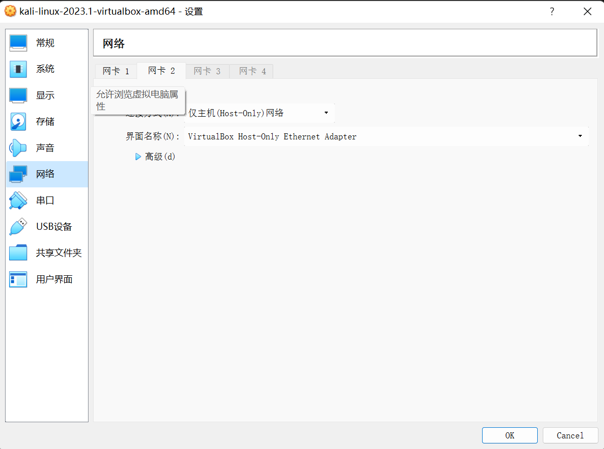
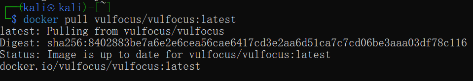
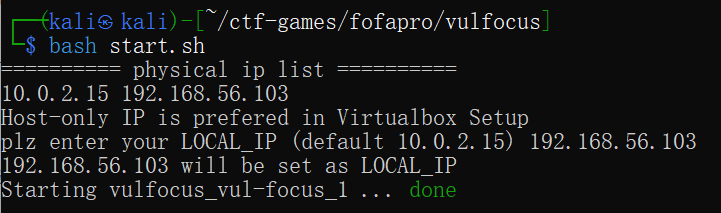
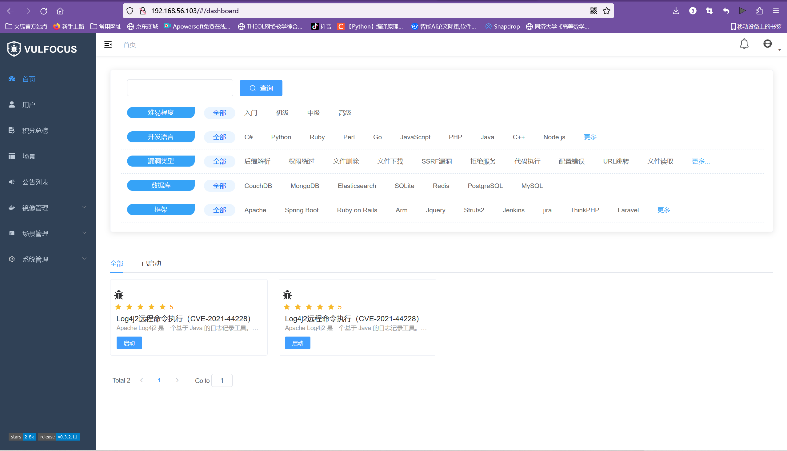
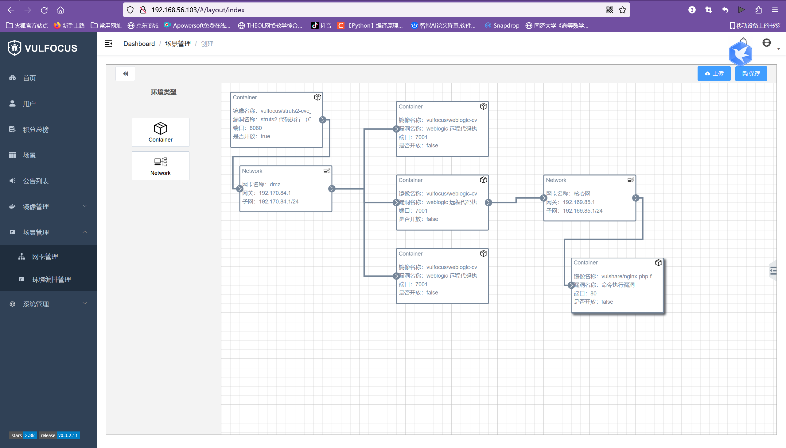
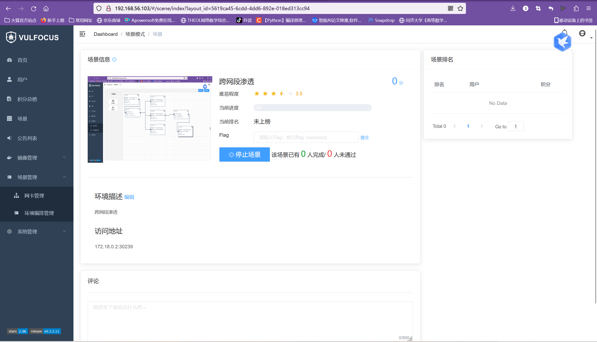
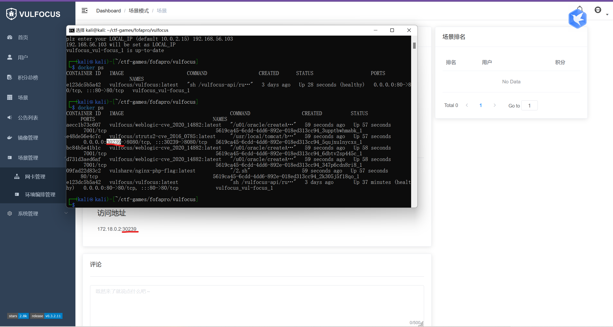
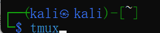
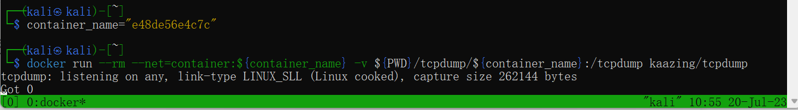
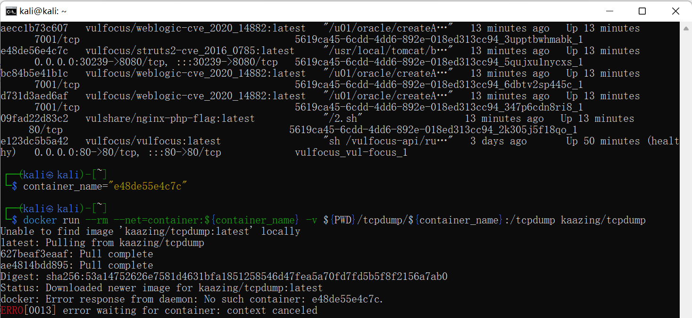

# 网络空间安全综合实践实验日志

## 纯净 Kali 首次启动后配置

由于已有可直接使用的kali虚拟机，故并未从0开始，只是在原有基础上添加了新的网卡，即host-only。



先检查网卡是否被启用

`ip -a`

使用vim进行文本编辑，启用网卡，用dhcp的方式来实现

`sudo vim /etc/network/interfaces`

之后输入配置代码

`allow-hotplug eth0` 
 
`iface eth0 inet dhcp`
 
`allow-hotplug eth1`
 
`iface eth1 inet dhcp`

之后运用传统保守管理网卡方式

`sudo ifdown eth0 && sudo ifup eth0`

`sudo ifdown eth1 && sudo ifup eth1`

接着

`cat /etc/os-release`

查看版本发行信息

`lsb_release -a`

查看内核信息

`uname -a`

关闭虚拟机改用无界面方式启动，并使用宿主机访问

`ssh kali@192.168.56.103`

发现没有办法访问。原因在于，在缺省情况下，kali没有开启ssh服务，再启用虚拟机界面开启

先设置开机自启动

`sudo systemctl enable ssh`

设置完开机自启动之后，未能直接启动，所以手动开启

`sudo systemctl start ssh`

验证开始

`ps aux | grep ssh`

确认开启，再换回宿主机运行

`ssh kali@192.168.56.103`

之后充值machine-id

`ls /etc/machine-id`

`cat /etc/machine-id`

`ls /var/lib/dbus/machine-id`

`cat /var/lib/dbus/machine-id`

之后重启确保生效

`sudo reboot`

## 安装 docker 和拉取镜像

搭建环境之前，首先检出仓库

`git clone https://github.com/c4pr1c3/ctf-games.git`

在ctf-games目录下进行操作

`cd ctf-games`

查看下属目录

`ls -l`

在ctf-games/fofapro目录下进行操作

`cd fofapro`

查看下属目录

`ls`

更新kali自带的镜像源

`sudo apt update`

安装docker

`sudo apt install -y docker.io docker-compose,jq`

再添加用户到docker组

`sudo usermod -a -G docker kali`

切换到root用户

`sudo su -`

改docker-hub镜像源为中科大镜像源

```
cat <<E0F > /etc/docker/deamon.json
 
 heredoc> {
          
          "registry-mirrors":["https://docker.mirrors.ustc.edu.cn/"]
          
          }

E0F
```

改完之后重启docker引擎服务

`sys/temctl restart docker`

退出root用户权限

`exit`

还需退出kali才能使权限生效，即退出再重新登录

`exit`

`ssh kali@092.168.56.103`

拉取vulfocus镜像

`docker pull vulfocus/vulfocus:latest`



## 快速上手 vulfocus

进入vulfocus目录

`cd ctf-games/fofapro/vulfocus`

启动vulfocus环境

`bash start.sh`



选择自己的host-only网卡。之后就可以通过地址在宿主机上访问vulfocus



## 跨网段多靶标攻防实验准备

首先由于官网已经不再提供下载和资源镜像分享，因此需要自己去设计构建相应的拓扑场景和镜像。

于是，先去下载了所需的几个镜像以及配置相应网卡，按照徐岩同学分享经验完成场景搭建



启动场景



验证端口是否一致

`docker ps`



启用tmux

`tmux`



输入相应容器名称进行监测

`container_name="e48de56e4c7c"

`docker run --rm --net=container:${container_name} -v ${PWD}/tcpdump/${container_name}:/tcpdump kaazing/tcpdump'



此处由于粗心大意，输错数字导致报错



至此，前期准备工作就绪

## 漏洞修复

通过对资料的查阅以及咨询别组同学，Weblogic-cve-2019-2725的漏洞源于在反序列化处理输入信息的过程中存在缺陷，未经授权的攻击者可以发送精心构造的恶意 HTTP 请求，利用该漏洞获取服务器权限，实现远程代码执行。

可以从Oracle官方漏洞复现源拿到漏洞镜像，根据Oracle的漏洞报告，此漏洞存在于异步通讯服务，通过访问路径

`/_async/AsyncResponseService`

判断不安全组件是否开启。wls9_async_response.war包中的类由于使用注解方法调用了Weblogic原生处理Web服务的类，因此会受该漏洞影响

继续分析漏洞是如何发送http请求从而获得权限的，在ProcessBuilder类中打下断点。首先程序是继承自HttpServlet的BaseWSServlet类，其中的service方法主要用于处理HTTP请求及其响应，通过HTTP协议发送的请求包封装在HttpServletRequest类的实例化对象var1中，调用BaseWSServlet中定义的内部类AuthorizedInvoke的run()方法完成传入HTTP对象的权限验证过程。若校验成功，则进入到SoapProcessor类的process方法中，通过调用HttpServletRequest类实例化对象var1的getMethod()方法获取HTTP请求类型，若为POST方法，则继续处理请求

HTTP请求发送至SoapProcessor类的handlePost方法：

```
private void handlePost(BaseWSServlet var1, HttpServletRequest var2, HttpServletResponse var3) throws IOException {
    assert var1.getPort() != null;

    WsPort var4 = var1.getPort();
    String var5 = var4.getWsdlPort().getBinding().getBindingType();
    HttpServerTransport var6 = new HttpServerTransport(var2, var3);
    WsSkel var7 = (WsSkel)var4.getEndpoint();
    try {
        Connection var8 = ConnectionFactory.instance().createServerConnection(var6, var5);
        var7.invoke(var8, var4);
    } catch (ConnectionException var9) {
        this.sendError(var3, var9, "Failed to create connection");
    } catch (Throwable var10) {
        this.sendError(var3, var10, "Unknown error");
    }
}
```

SOAP是一种通信协议，用于应用程序之间的通信。它是一种轻量的、简单的、基于XML的协议，可以独立于平台和语言进行通信。SOAP定义了数据交互中如何传递消息的规则，比如在HTTP中规定了POST请求的传参方式，在数据类型不同的情况下可以使用不同的参数方式。

在整个进程调用中，BaseWSServlet类实例化对象var1封装了基于HTTP协议的SOAP消息。其中WorkAreaServerHandler类中的handleRequest()方法用于处理访问请求，通过WlMessageContext对象var2获取传入的MessageContext，调用var2对象的getHeaders()方法获取传入SOAP消息的Header元素，并最终将该元素传递到WorkAreaHeader对象var4中。通过上述漏洞调用过程分析，要想有效修复漏洞，需要开发补丁,最直接的方法是在路径weblogic/wsee/workarea/WorkContextXmlInputAdapter.java中添加了validate方法，即在调用startElement方法解析XML的过程中，如果解析到Element字段值为Object就抛出异常

龙某觱篥DYS:
## 漏洞修复

通过对资料的查阅以及咨询别组同学，Weblogic-cve-2019-2725的漏洞源于在反序列化处理输入信息的过程中存在缺陷，未经授权的攻击者可以发送精心构造的恶意 HTTP 请求，利用该漏洞获取服务器权限，实现远程代码执行。

可以从Oracle官方漏洞复现源拿到漏洞镜像，根据Oracle的漏洞报告，此漏洞存在于异步通讯服务，通过访问路径

`/_async/AsyncResponseService`

判断不安全组件是否开启。wls9_async_response.war包中的类由于使用注解方法调用了Weblogic原生处理Web服务的类，因此会受该漏洞影响

继续分析漏洞是如何发送http请求从而获得权限的，在ProcessBuilder类中打下断点。首先程序是继承自HttpServlet的BaseWSServlet类，其中的service方法主要用于处理HTTP请求及其响应，通过HTTP协议发送的请求包封装在HttpServletRequest类的实例化对象var1中，调用BaseWSServlet中定义的内部类AuthorizedInvoke的run()方法完成传入HTTP对象的权限验证过程。若校验成功，则进入到SoapProcessor类的process方法中，通过调用HttpServletRequest类实例化对象var1的getMethod()方法获取HTTP请求类型，若为POST方法，则继续处理请求

HTTP请求发送至SoapProcessor类的handlePost方法：

```
private void handlePost(BaseWSServlet var1, HttpServletRequest var2, HttpServletResponse var3) throws IOException {
    assert var1.getPort() != null;

    WsPort var4 = var1.getPort();
    String var5 = var4.getWsdlPort().getBinding().getBindingType();
    HttpServerTransport var6 = new HttpServerTransport(var2, var3);
    WsSkel var7 = (WsSkel)var4.getEndpoint();
    try {
        Connection var8 = ConnectionFactory.instance().createServerConnection(var6, var5);
        var7.invoke(var8, var4);
    } catch (ConnectionException var9) {
        this.sendError(var3, var9, "Failed to create connection");
    } catch (Throwable var10) {
        this.sendError(var3, var10, "Unknown error");
    }
}
```

SOAP是一种通信协议，用于应用程序之间的通信。它是一种轻量的、简单的、基于XML的协议，可以独立于平台和语言进行通信。SOAP定义了数据交互中如何传递消息的规则，比如在HTTP中规定了POST请求的传参方式，在数据类型不同的情况下可以使用不同的参数方式。

在整个进程调用中，BaseWSServlet类实例化对象var1封装了基于HTTP协议的SOAP消息。其中WorkAreaServerHandler类中的handleRequest()方法用于处理访问请求，通过WlMessageContext对象var2获取传入的MessageContext，调用var2对象的getHeaders()方法获取传入SOAP消息的Header元素，并最终将该元素传递到WorkAreaHeader对象var4中。通过上述漏洞调用过程分析，要想有效修复漏洞，需要开发补丁,最直接的方法是在路径weblogic/wsee/workarea/WorkContextXmlInputAdapter.java中添加了validate方法，即在调用startElement方法解析XML的过程中，如果解析到Element字段值为Object就抛出异常

```
private void validate(InputStream is) {
     WebLogicSAXParserFactory factory = new WebLogicSAXParserFactory();
      try {
         SAXParser parser = factory.newSAXParser();
         parser.parse(is, new DefaultHandler() {
            public void startElement(String uri, String localName, String qName, Attributes attributes) throws SAXException {
               if(qName.equalsIgnoreCase("object")) {
                  throw new IllegalStateException("Invalid context type: object");
               }
            }
         });
      } catch (ParserConfigurationException var5) {
         throw new IllegalStateException("Parser Exception", var5);
      } catch (SAXException var6) {
         throw new IllegalStateException("Parser Exception", var6);
      } catch (IOException var7) {
         throw new IllegalStateException("Parser Exception", var7);
      }
   }
```

然而，采用黑名单的防护措施很快就被POC轻松绕过，因为其中不包含任何Object元素。尽管经过XMLDecoder解析后，这种方法仍然会导致远程代码执行，例如给出一段poc：

```
<java version="1.4.0" class="java.beans.XMLDecoder">
    <new class="java.lang.ProcessBuilder">
        <string>calc</string><method name="start" />
    </new>
</java>
```

因为其中不包含任何Object元素，但经XMLDecoder解析后依旧造成了远程代码执行

因此，我们需要将更多的关键字漏洞加入到黑名单中，从而做到当程序解析到关键字属性的字样时，即设置为异常，object、new、method关键字继续加入到黑名单中，一旦解析XML元素过程中匹配到上述任意一个关键字就立即抛出运行时异常。

但是针对void和array这两个元素是有选择性的抛异常，其中当解析到void元素后，还会进一步解析该元素中的属性名，若没有匹配上index关键字才会抛出异常。而针对array元素而言，在解析到该元素属性名匹配class关键字的前提下，还会解析该属性值，若没有匹配上byte关键字，才会抛出运行时异常：

```
public void startElement(String uri, String localName, String qName, Attributes attributes) throws SAXException {
            if(qName.equalsIgnoreCase("object")) {
               throw new IllegalStateException("Invalid element qName:object");
            } else if(qName.equalsIgnoreCase("new")) {
              throw new IllegalStateException("Invalid element qName:new");
            } else if(qName.equalsIgnoreCase("method")) {
               throw new IllegalStateException("Invalid element qName:method");
            } else {
               if(qName.equalsIgnoreCase("void")) {
                  for(int attClass = 0; attClass < attributes.getLength(); ++attClass) {
                     if(!"index".equalsIgnoreCase(attributes.getQName(attClass))) {
                        throw new IllegalStateException("Invalid attribute for element void:" + attributes.getQName(attClass));
                     }
                  }
               }
               if(qName.equalsIgnoreCase("array")) {
       String var9 = attributes.getValue("class");
       if(var9 != null && !var9.equalsIgnoreCase("byte")) {
      throw new IllegalStateException("The value of class attribute is not valid for array element.");
     }
```

