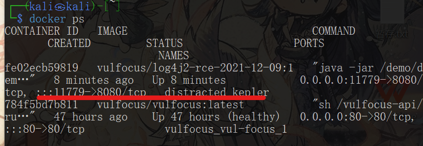

## Mandy

### 综合实践

#### 视频资料学习

- 内容提纲
  基础运行环境准备
  漏洞攻防环境现状
  漏洞攻防环境搭建
  漏洞攻击
  漏洞利用监测
  漏洞利用防御与加固


##### 一. 基础运行环境准备

- 准备一个kali的虚拟机镜像
  网络设置--网络地址转换NAT（方便虚拟机有互联网连接）、仅主机网络（方便本地终端连接虚拟机）

- 开启虚拟机查看ip
  >ip a

  

  ip地址成功分配
  
  若有一块没有解决方式为
  >sudo vim /etc/network/interfaces

  文件修改如下，增添：
  ```
  allow-hotplug eth0
  iface eth0 inet dhcp

  allow-hotplug eth1
  iface eth1 inet dhcp

  ```
  然后
  >sudo ifdown eth0 && sudo ifup eth0

  >sudo ifdown eth1 && sudo ifup eth1

  查看发行版本信息：
  >lsb_release -a

  查看内核信息：
  >uname -a

- ssh服务
  
  >ssh kali@ip

  
  
  linux没有开启ssh服务

  在虚拟机中，设置开机自启动
  >sudo systemctl enable ssh

  启动ssh
  >sudo systemctl start ssh

  查看
  >ps aux | grep ssh

  

  重新连接
  

  配置免密登录
  >ssh-copy-id -i ~/.ssh/con
  >ssh-copy-id -i ~/.ssh/id_rsa.pub kali@IP
  >ssh kali@IP

##### 二. 漏洞攻防环境现状


##### 三. 安装docker和拉取镜像

- 虚拟机中：
  >git clone https://github.com/c4pr1c3/ctf-games.git
  >cd ctf-games
  >ls -l
  >cd fofapro
  >ls


- 安装docker
  更新
  >sudo apt update

  - 出现报错
    ```
    11 packages can be upgraded. Run 'apt list --upgradable' to see them.
    W: https://download.docker.com/linux/ubuntu/dists/zesty/InRelease: Key is stored in legacy trusted.gpg keyring (/etc/apt/trusted.gpg), see the DEPRECATION section in apt-key(8) for details.
    ```
   
    通过chatAI搜索问题解决办法得：
    下面是一套详细的解决步骤，用于解决“Key is stored in legacy trusted.gpg keyring”警告以及更新软件包的问题：

    1. 备份旧的 trusted.gpg 文件（如果有需要）
      >sudo cp /etc/apt/trusted.gpg /etc/apt/trusted.gpg.backup

      这样可以备份旧的 trusted.gpg 文件，以防需要恢复。

    2. 删除旧的 trusted.gpg 文件：
   
      >sudo rm /etc/apt/trusted.gpg

      这将删除旧的 trusted.gpg 文件，系统将在需要时重新生成。

    3. 下载并导入 Docker GPG 密钥：
   
      >curl -fsSL https://download.docker.com/linux/ubuntu/gpg | gpg --dearmor | sudo tee /etc/apt/trusted.gpg.d/docker-archive-keyring.gpg >/dev/null

      这个命令将下载 Docker GPG 密钥，并将其导入 `/etc/apt/trusted.gpg.d/docker-archive-keyring.gpg` 文件中。

    4. 更新软件包列表：

      >sudo apt update

      这将更新软件包列表，同时导入了新版本的 Docker GPG 密钥。

    5. 查看可升级的软件包：

      >apt list --upgradable

      这个命令会列出所有可以升级的软件包，方便你进行选择。

    6. 升级软件包：
   
      >sudo apt upgrade

      运行此命令来升级可用的软件包。

    问题解决

    >sudo apt install -y docker docker-compose jq

  添加当前用户(可以使后面的很多docker命令不需要sudo)
  >sudo usermod -a -G docker kali

  在`/etc/docker/daemon.json`中添加
  ```
  {
      "registry-mirrors":["https://docker.mirrors.ustc.edu.cn/"]
  }
  ```
  
  重启docker镜像服务
  >systemctl restart docker

  - 出现报错：
    ```
    Job for docker.service failed because the control process exited with error code.
    See "systemctl status docker.service" and "journalctl -xeu docker.service" for details.
    ```
    查看Docker服务的状态：
    >systemctl status docker.service

    查看Docker服务的详细日志：
    >journalctl -xeu docker.service

    结果如下：
    ```
    The unit docker.service has entered the 'failed' state with result 'exit-code'.
    Jul 17 07:03:14 kali systemd[1]: Failed to start docker.service - Docker Application C> 
    ░░ Subject: A start job for unit docker.service has failed
    ░░ Defined-By: systemd
    ```
    
    通过ChatAI查询获得以下解决方式：

    - 清理残留进程和套接字：
        ```
        sudo systemctl stop docker.socket
        sudo systemctl stop docker.service
        sudo rm /var/run/docker.sock
        sudo systemctl start docker.service
        ```
        问题没有解决
    


    - 检查Docker配置：是否有格式错误（检查未发现）


    - 尝试重新安装Docker
        
        可能存在Docker软件包损坏或配置文件被破坏的情况。尝试重新安装Docker以修复可能的错误。运行以下命令

        ```
        sudo apt update
        sudo apt remove --purge docker.io
        sudo apt install docker.io
        ```

        执行到`sudo apt remove --purge docker.io`出现报错`E: dpkg was interrupted, you must manually run 'dpkg --configure -a' to correct the problem.`

        执行`dpkg --configure -a`进行修复

        重新执行docker安装操作，结果报错找不到docker包。。。。。

    - 尝试添加Docker官方源：
        ```
        sudo apt update
        sudo apt install -y apt-transport-https ca-certificates curl software-properties-common
        curl -fsSL https://download.docker.com/linux/ubuntu/gpg | sudo gpg --dearmor -o /usr/share/keyrings/docker-archive-keyring.gpg
        echo "deb [arch=amd64 signed-by=/usr/share/keyrings/docker-archive-keyring.gpg] https://download.docker.com/linux/ubuntu $(lsb_release -cs) stable" | sudo tee /etc/apt/sources.list.d/docker.list > /dev/null
        ```

    - 更新软件包：
        >sudo apt update

        又报错。。。。。。

        ```
        Err:3 https://download.docker.com/linux/debian kali-rolling Release
        404  Not Found [IP: 13.32.121.78 443]
        Reading package lists... Done
        E: The repository 'https://download.docker.com/linux/debian kali-rolling Release' does not have a Release file.
        N: Updating from such a repository can't be done securely, and is therefore disabled by default.
        N: See apt-secure(8) manpage for repository creation and user configuration details.
        ```

    决定恢复备份，重新做人。。

- 重新尝试安装docker
  
  完成前面基础部分，虚拟机生成备份。

  >sudo apt update

  >sudo apt install -y docker.io docker-compose jq

  

  添加用户(使后续的docker命令操作不需要sudo)
  
  >sudo usermod -a -G docker kali

  切换到root用户

  在`/etc/docker/daemon.json`中添加
  ```
  {
      "registry-mirrors":["https://docker.mirrors.ustc.edu.cn/"]
  }
  ```
  
  
        
  重启docker引擎服务

  >systemctl restart docker

  退出root权限`exit`

  

- 拉取镜像
  
  提前拉取vulfocus镜像
  >docker pull vulfocus/vulfocus:latest

  

  重新登录一下(虽然已将用户加入到docker组里，但是需要重新登录一下才可以生效)

  >exit

  >ssh@IP

  >id

  
  
  再执行`docker pull`

  >docker pull vulfocus/vulfocus:latest

  

##### 快速上手vulfocus

- 进入vulfocus目录，执行start.sh
  
  >cd ctf-games/fofapro/vulfocus

  >ls

  >bash start.sh

  

  >docker ps

  
  
  在宿主机直接搜索IP可以看到页面
  

  输入账号/密码登录（admin/admin)

  左侧镜像管理-点击一键同步
  

  

##### 知法守法

##### 漏洞攻击导论

从单个漏洞靶标开始——一切来自于用户输入的数据都是不可信的

```
1.找到靶标的[访问入口]
2.收集[威胁暴露面]信息
3.监测漏洞存在性
4.验证漏送可利用性
5.评估漏洞利用效果
```

##### log4j2

- log4j2  CVE-2021-44228

- 找到靶标访问入口
  
  

- 漏洞原理详解
  
  [从零到一带你深入 log4j2 Jndi RCE CVE-2021-44228漏洞](https://www.anquanke.com/post/id/263325)

  [如何看待log4j2远程代码执行漏洞](https://www.zhihu.com/question/505025655)

  [Log4j2 漏洞详解 (CVE-2021-44228)](https://blog.cloudflare.com/zh-cn/inside-the-log4j2-vulnerability-cve-2021-44228-zh-cn/)

- 检测log4Shell漏洞存在性
  
  - 确认受漏洞影响组件的【版本号】
    
  - 源代码审计

  
  
  进入容器
  >docker exec -it <容器名> bash

  (可能存在bash不在环境变量等情况，可以通过改为`/bin/bash`解决)

  

  可以看到缺省情况下，目标文件`demo.jar`已经存在

  

  把`demo.jar`拉到宿主机上，用java的反编译器反编译。
  
  查看路径并退出
  >pwd

  

  >exit
  
  将文件从容器内移出
  >docker cp <容器名>:/demo/demo.jar ./
  
  

  再将文件挪到宿主机上方便读取

  找了一个在线的反编译网站
  [反编译网站](https://www.decompiler.com/jar/9b05d0c56c0f4bd582987faed8865ab1/demo.jar)

  得到所需

- 验证log4Shell漏洞可利用

  无法打开`dnslog.cn`
  
  尝试其他可代替网站，[参考文章](https://blog.csdn.net/qq_53577336/article/details/118615216#:~:text=%E6%8E%A8%E8%8D%90%E4%B8%89%E4%B8%AA%E5%A4%A7%E4%BC%97%E5%8C%96%E7%9A%84%E5%85%8D%E8%B4%B9dns%E8%A7%A3%E6%9E%90%E8%AE%B0%E5%BD%95%E7%BD%91%E7%AB%99%20http%3A%2F%2Fwww.dnslog.cn%20http%3A%2F%2Fadmin.dnslog.link,http%3A%2F%2Fceye.io%200x03%20DNSlog%E5%9B%9E%E6%98%BE%E6%B3%A8%E5%85%A5%E6%9D%A1%E4%BB%B6)

  `http://admin.dnslog.link`

  `http://ceye.io`

  经尝试第三个可以登录

  进行该网站使用方法的学习

  - 参考资料
    
    [CEYEintroduce](http://ceye.io/introduce)

    [DNSlog介绍](https://blog.csdn.net/qq_53577336/article/details/118615216#:~:text=%E6%8E%A8%E8%8D%90%E4%B8%89%E4%B8%AA%E5%A4%A7%E4%BC%97%E5%8C%96%E7%9A%84%E5%85%8D%E8%B4%B9dns%E8%A7%A3%E6%9E%90%E8%AE%B0%E5%BD%95%E7%BD%91%E7%AB%99%20http%3A%2F%2Fwww.dnslog.cn%20http%3A%2F%2Fadmin.dnslog.link,http%3A%2F%2Fceye.io%200x03%20DNSlog%E5%9B%9E%E6%98%BE%E6%B3%A8%E5%85%A5%E6%9D%A1%E4%BB%B6)

    [CEYE平台的使用](https://dzxindex.github.io/2021/12/14/security-CEYE/#ceye-%E6%98%AF%E4%BB%80%E4%B9%88)

    [CEYE平台的使用max](https://www.cnblogs.com/zhaijiahui/p/9160913.html)


  
  


1. 漏洞利用监测
2. 漏洞利用防御与加固